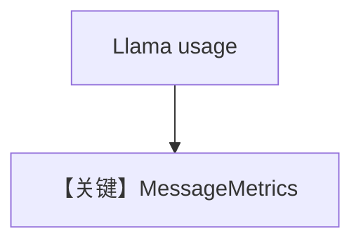

# metrics.md — 实现原理分析

> 源文件：`cookbook/90_models/meta/llama/metrics.py`

## 概述

**`Llama` + YFinance**，同步 `agent.run`，打印消息级与 `RunOutput.metrics`。

**核心配置一览：**

| 配置项 | 值 | 说明 |
|--------|-----|------|
| `model` | `Llama(id="Llama-4-Maverick-17B-128E-Instruct-FP8")` | Meta |
| `tools` | `[YFinanceTools()]` | 工具 |
| `markdown` | `True` | Markdown |

## Mermaid 流程图

## 关键源码文件索引

| 文件 | 关键 |
|------|------|
| `agno/models/meta/llama.py` | `_parse_provider_response` |
