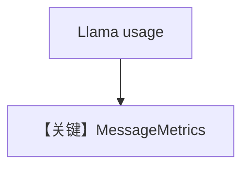

# metrics.md — 实现原理分析

<!-- cookbook-py-source:start -->
## 完整源码

```python
"""
Meta Metrics
============

Cookbook example for `meta/llama/metrics.py`.
"""

from agno.agent import Agent, RunOutput
from agno.models.meta import Llama
from agno.tools.yfinance import YFinanceTools
from agno.utils.pprint import pprint_run_response
from rich.pretty import pprint

# ---------------------------------------------------------------------------
# Create Agent
# ---------------------------------------------------------------------------

agent = Agent(
    model=Llama(id="Llama-4-Maverick-17B-128E-Instruct-FP8"),
    tools=[YFinanceTools()],
    markdown=True,
)

run_output: RunOutput = agent.run("What is the stock price of NVDA")
pprint_run_response(run_output, markdown=True)

# Print metrics per message
if run_output.messages:
    for message in run_output.messages:
        if message.role == "assistant":
            if message.content:
                print(f"Message: {message.content}")
            elif message.tool_calls:
                print(f"Tool calls: {message.tool_calls}")
            print("---" * 5, "Metrics", "---" * 5)
            pprint(message.metrics)
            print("---" * 20)

# Print the metrics
print("---" * 5, "Collected Metrics", "---" * 5)
pprint(run_output.metrics)  # type: ignore

# ---------------------------------------------------------------------------
# Run Agent
# ---------------------------------------------------------------------------

if __name__ == "__main__":
    pass
```

<!-- cookbook-py-source:end -->

> 源文件：`cookbook/90_models/meta/llama/metrics.py`

## 概述

**`Llama` + YFinance**，同步 `agent.run`，打印消息级与 `RunOutput.metrics`。

**核心配置一览：**

| 配置项 | 值 | 说明 |
|--------|-----|------|
| `model` | `Llama(id="Llama-4-Maverick-17B-128E-Instruct-FP8")` | Meta |
| `tools` | `[YFinanceTools()]` | 工具 |
| `markdown` | `True` | Markdown |

## Mermaid 流程图



## 关键源码文件索引

| 文件 | 关键 |
|------|------|
| `agno/models/meta/llama.py` | `_parse_provider_response` |
