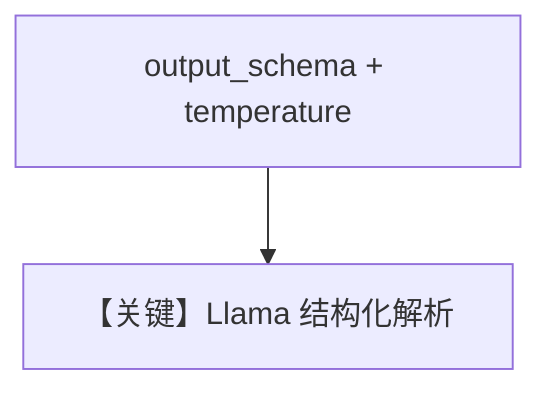

# structured_output.md — 实现原理分析

<!-- cookbook-py-source:start -->
## 完整源码

```python
"""
Meta Structured Output
======================

Cookbook example for `meta/llama/structured_output.py`.
"""

from typing import List

from agno.agent import Agent, RunOutput  # noqa
from agno.models.meta import Llama
from pydantic import BaseModel, Field
from rich.pretty import pprint  # noqa

# ---------------------------------------------------------------------------
# Create Agent
# ---------------------------------------------------------------------------


class MovieScript(BaseModel):
    setting: str = Field(
        ..., description="Provide a nice setting for a blockbuster movie."
    )
    ending: str = Field(
        ...,
        description="Ending of the movie. If not available, provide a happy ending.",
    )
    genre: str = Field(
        ...,
        description="Genre of the movie. If not available, select action, thriller or romantic comedy.",
    )
    name: str = Field(..., description="Give a name to this movie")
    characters: List[str] = Field(..., description="Name of characters for this movie.")
    storyline: str = Field(
        ..., description="3 sentence storyline for the movie. Make it exciting!"
    )


# Agent that uses a JSON schema output
json_schema_output_agent = Agent(
    model=Llama(id="Llama-4-Maverick-17B-128E-Instruct-FP8", temperature=0.1),
    output_schema=MovieScript,
)

json_schema_output_agent.print_response("New York")

# ---------------------------------------------------------------------------
# Run Agent
# ---------------------------------------------------------------------------

if __name__ == "__main__":
    pass
```

<!-- cookbook-py-source:end -->

> 源文件：`cookbook/90_models/meta/llama/structured_output.py`

## 概述

**`Llama` + `output_schema=MovieScript` + `temperature=0.1`**，**无** `use_json_mode`（注释称 JSON schema output）。

**核心配置一览：**

| 配置项 | 值 | 说明 |
|--------|-----|------|
| `model` | `Llama(id="Llama-4-Maverick-17B-128E-Instruct-FP8", temperature=0.1)` | Meta |
| `output_schema` | `MovieScript` | 结构 |

## Mermaid 流程图



## 关键源码文件索引

| 文件 | 关键 |
|------|------|
| `agno/models/meta/llama.py` | `get_request_params` response_format |
