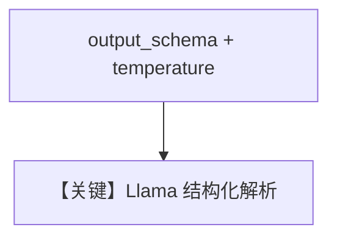

# structured_output.md — 实现原理分析

> 源文件：`cookbook/90_models/meta/llama/structured_output.py`

## 概述

**`Llama` + `output_schema=MovieScript` + `temperature=0.1`**，**无** `use_json_mode`（注释称 JSON schema output）。

**核心配置一览：**

| 配置项 | 值 | 说明 |
|--------|-----|------|
| `model` | `Llama(id="Llama-4-Maverick-17B-128E-Instruct-FP8", temperature=0.1)` | Meta |
| `output_schema` | `MovieScript` | 结构 |

## Mermaid 流程图

## 关键源码文件索引

| 文件 | 关键 |
|------|------|
| `agno/models/meta/llama.py` | `get_request_params` response_format |
