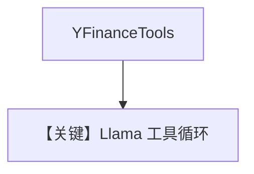

# tool_use.md — 实现原理分析

> 源文件：`cookbook/90_models/meta/llama/tool_use.py`

## 概述

**`Llama` + YFinance**，未设 `markdown`（默认 False），四种调用方式。

**核心配置一览：**

| 配置项 | 值 | 说明 |
|--------|-----|------|
| `model` | `Llama(id="Llama-4-Maverick-17B-128E-Instruct-FP8")` | Meta |
| `tools` | `[YFinanceTools()]` | 金融 |

## Mermaid 流程图

## 关键源码文件索引

| 文件 | 关键 |
|------|------|
| `agno/models/meta/llama.py` | `invoke` |
