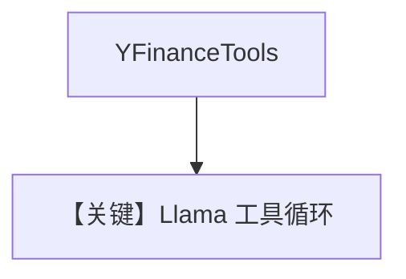

# tool_use.md — 实现原理分析

<!-- cookbook-py-source:start -->
## 完整源码

```python
"""Run `uv pip install agno llama-api-client yfinance` to install dependencies."""

import asyncio

from agno.agent import Agent
from agno.models.meta import Llama
from agno.tools.yfinance import YFinanceTools

# ---------------------------------------------------------------------------
# Create Agent
# ---------------------------------------------------------------------------

agent = Agent(
    model=Llama(id="Llama-4-Maverick-17B-128E-Instruct-FP8"),
    tools=[YFinanceTools()],
)

# ---------------------------------------------------------------------------
# Run Agent
# ---------------------------------------------------------------------------
if __name__ == "__main__":
    # --- Sync ---
    agent.print_response("What is the price of AAPL stock?")

    # --- Sync + Streaming ---
    agent.print_response("Tell me the price of AAPL stock", stream=True)

    # --- Async ---
    asyncio.run(agent.aprint_response("Whats the price of AAPL stock?"))

    # --- Async + Streaming ---
    asyncio.run(agent.aprint_response("Whats the price of AAPL stock?", stream=True))
```

<!-- cookbook-py-source:end -->

> 源文件：`cookbook/90_models/meta/llama/tool_use.py`

## 概述

**`Llama` + YFinance**，未设 `markdown`（默认 False），四种调用方式。

**核心配置一览：**

| 配置项 | 值 | 说明 |
|--------|-----|------|
| `model` | `Llama(id="Llama-4-Maverick-17B-128E-Instruct-FP8")` | Meta |
| `tools` | `[YFinanceTools()]` | 金融 |

## Mermaid 流程图



## 关键源码文件索引

| 文件 | 关键 |
|------|------|
| `agno/models/meta/llama.py` | `invoke` |
