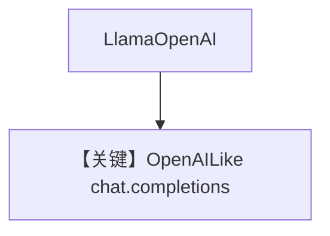

# basic.md — 实现原理分析

<!-- cookbook-py-source:start -->
## 完整源码

```python
"""
Meta Basic
==========

Cookbook example for `meta/llama_openai/basic.py`.
"""

from agno.agent import Agent, RunOutput  # noqa
from agno.models.meta import LlamaOpenAI
import asyncio

# ---------------------------------------------------------------------------
# Create Agent
# ---------------------------------------------------------------------------

agent = Agent(
    model=LlamaOpenAI(id="Llama-4-Maverick-17B-128E-Instruct-FP8"),
    markdown=True,
)

# Get the response in a variable
# run: RunOutput = agent.run("Share a 2 sentence horror story")
# print(run.content)

# Print the response in the terminal

# ---------------------------------------------------------------------------
# Run Agent
# ---------------------------------------------------------------------------
if __name__ == "__main__":
    # --- Sync ---
    agent.print_response("Share a 2 sentence horror story")

    # --- Sync + Streaming ---
    agent.print_response("Share a 2 sentence horror story", stream=True)

    # --- Async ---
    asyncio.run(agent.aprint_response("Share a 2 sentence horror story"))

    # --- Async + Streaming ---
    asyncio.run(agent.aprint_response("Share a 2 sentence horror story", stream=True))
```

<!-- cookbook-py-source:end -->

> 源文件：`cookbook/90_models/meta/llama_openai/basic.py`

## 概述

**`LlamaOpenAI`** 全模式调用，与 `meta/llama/basic.py` 平行，走 **OpenAI 兼容** 客户端（`llama_openai.py` 继承 `OpenAILike`）。

**核心配置一览：**

| 配置项 | 值 | 说明 |
|--------|-----|------|
| `model` | `LlamaOpenAI(id="Llama-4-Maverick-17B-128E-Instruct-FP8")` | Meta OpenAI 端点 |
| `markdown` | `True` | Markdown |

## Mermaid 流程图



## 关键源码文件索引

| 文件 | 关键 |
|------|------|
| `agno/models/meta/llama_openai.py` | `LlamaOpenAI` |
