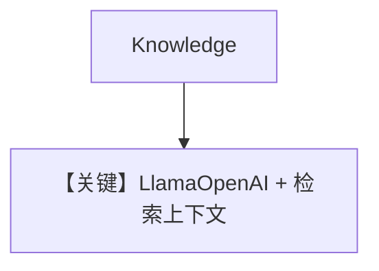

# knowledge.md — 实现原理分析

> 源文件：`cookbook/90_models/meta/llama_openai/knowledge.py`

## 概述

**`LlamaOpenAI` + Knowledge(PgVector)**。

**核心配置一览：**

| 配置项 | 值 | 说明 |
|--------|-----|------|
| `model` | `LlamaOpenAI(id="Llama-4-Maverick-17B-128E-Instruct-FP8")` | OpenAI 兼容 |
| `knowledge` | `Knowledge(...)` | RAG |

## Mermaid 流程图

## 关键源码文件索引

| 文件 | 关键 |
|------|------|
| `agno/models/meta/llama_openai.py` | `LlamaOpenAI` |
