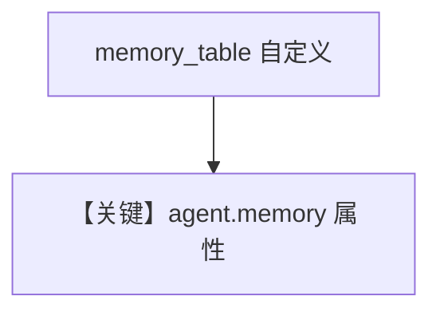

# memory.md — 实现原理分析

> 源文件：`cookbook/90_models/meta/llama_openai/memory.py`

## 概述

**`PostgresDb(db_url=..., memory_table="agent_memory")` + `update_memory_on_run` + `enable_session_summaries` + `debug_mode=True`**，直接访问 **`agent.memory.memories` / `summaries`**。

**核心配置一览：**

| 配置项 | 值 | 说明 |
|--------|-----|------|
| `model` | `LlamaOpenAI(id="Llama-4-Maverick-17B-128E-Instruct-FP8")` | OpenAI 兼容 |
| `db` | `PostgresDb(..., memory_table="agent_memory")` | 自定义记忆表名 |
| `update_memory_on_run` | `True` | 记忆 |
| `enable_session_summaries` | `True` | 摘要 |
| `debug_mode` | `True` | 调试 |

## Mermaid 流程图

## 关键源码文件索引

| 文件 | 关键 |
|------|------|
| `agno/db/postgres.py` | `PostgresDb` |
| `agno/agent/agent.py` | `memory` |
