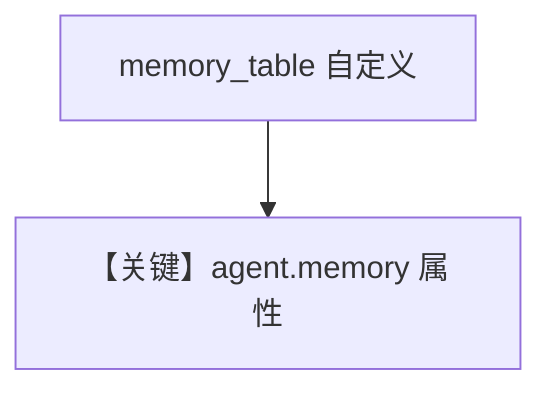

# memory.md — 实现原理分析

<!-- cookbook-py-source:start -->
## 完整源码

```python
"""
This recipe shows how to use personalized memories and summaries in an agent.
Steps:
1. Run: `./cookbook/scripts/run_pgvector.sh` to start a postgres container with pgvector
2. Run: `uv pip install openai sqlalchemy 'psycopg[binary]' pgvector` to install the dependencies
3. Run: `python cookbook/agents/personalized_memories_and_summaries.py` to run the agent
"""

from agno.agent import Agent
from agno.db.postgres import PostgresDb
from agno.models.meta import LlamaOpenAI
from rich.pretty import pprint

# ---------------------------------------------------------------------------
# Create Agent
# ---------------------------------------------------------------------------

db_url = "postgresql+psycopg://ai:ai@localhost:5532/ai"
agent = Agent(
    model=LlamaOpenAI(id="Llama-4-Maverick-17B-128E-Instruct-FP8"),
    # Store sessions, memories and summaries in the
    db=PostgresDb(db_url=db_url, memory_table="agent_memory"),
    update_memory_on_run=True,
    enable_session_summaries=True,
    # Show debug logs so, you can see the memory being created
    debug_mode=True,
)

# -*- Share personal information
agent.print_response("My name is john billings?", stream=True)
# -*- Print memories
pprint(agent.memory.memories)
# -*- Print summary
pprint(agent.memory.summaries)

# -*- Share personal information
agent.print_response("I live in nyc?", stream=True)
# -*- Print memories
pprint(agent.memory.memories)
# -*- Print summary
pprint(agent.memory.summaries)

# -*- Share personal information
agent.print_response("I'm going to a concert tomorrow?", stream=True)
# -*- Print memories
pprint(agent.memory.memories)
# -*- Print summary
pprint(agent.memory.summaries)

# Ask about the conversation
agent.print_response(
    "What have we been talking about, do you know my name?", stream=True
)

# ---------------------------------------------------------------------------
# Run Agent
# ---------------------------------------------------------------------------

if __name__ == "__main__":
    pass
```

<!-- cookbook-py-source:end -->

> 源文件：`cookbook/90_models/meta/llama_openai/memory.py`

## 概述

**`PostgresDb(db_url=..., memory_table="agent_memory")` + `update_memory_on_run` + `enable_session_summaries` + `debug_mode=True`**，直接访问 **`agent.memory.memories` / `summaries`**。

**核心配置一览：**

| 配置项 | 值 | 说明 |
|--------|-----|------|
| `model` | `LlamaOpenAI(id="Llama-4-Maverick-17B-128E-Instruct-FP8")` | OpenAI 兼容 |
| `db` | `PostgresDb(..., memory_table="agent_memory")` | 自定义记忆表名 |
| `update_memory_on_run` | `True` | 记忆 |
| `enable_session_summaries` | `True` | 摘要 |
| `debug_mode` | `True` | 调试 |

## Mermaid 流程图



## 关键源码文件索引

| 文件 | 关键 |
|------|------|
| `agno/db/postgres.py` | `PostgresDb` |
| `agno/agent/agent.py` | `memory` |
