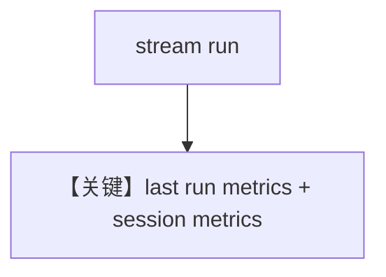

# metrics.md — 实现原理分析

<!-- cookbook-py-source:start -->
## 完整源码

```python
"""
Meta Metrics
============

Cookbook example for `meta/llama_openai/metrics.py`.
"""

from typing import Iterator

from agno.agent import Agent, RunOutputEvent
from agno.models.meta import LlamaOpenAI
from agno.tools.yfinance import YFinanceTools
from agno.utils.pprint import pprint_run_response
from rich.pretty import pprint

# ---------------------------------------------------------------------------
# Create Agent
# ---------------------------------------------------------------------------

agent = Agent(
    model=LlamaOpenAI(id="Llama-4-Maverick-17B-128E-Instruct-FP8"),
    tools=[YFinanceTools()],
    markdown=True,
)

run_stream: Iterator[RunOutputEvent] = agent.run(
    "What is the stock price of NVDA", stream=True
)
pprint_run_response(run_stream, markdown=True)

run_response = agent.get_last_run_output()

# Print metrics per message
if run_response.messages:
    for message in agent.run_response.messages:
        if message.role == "assistant":
            if message.content:
                print(f"Message: {message.content}")
            elif message.tool_calls:
                print(f"Tool calls: {message.tool_calls}")
            print("---" * 5, "Metrics", "---" * 5)
            pprint(message.metrics)
            print("---" * 20)

# Print the metrics
print("---" * 5, "Collected Metrics", "---" * 5)
pprint(run_response.metrics)
# Print the session metrics
print("---" * 5, "Session Metrics", "---" * 5)
pprint(agent.get_session_metrics())

# ---------------------------------------------------------------------------
# Run Agent
# ---------------------------------------------------------------------------

if __name__ == "__main__":
    pass
```

<!-- cookbook-py-source:end -->

> 源文件：`cookbook/90_models/meta/llama_openai/metrics.py`

## 概述

**流式 `agent.run(..., stream=True)` + `pprint_run_response` + `get_last_run_output()`**，并遍历 **`agent.run_response.messages`** 打印 metrics（与同步 metrics 示例不同）。

**核心配置一览：**

| 配置项 | 值 | 说明 |
|--------|-----|------|
| `model` | `LlamaOpenAI(id="Llama-4-Maverick-17B-128E-Instruct-FP8")` | OpenAI 兼容 |
| `tools` | `[YFinanceTools()]` | 工具 |
| `markdown` | `True` | Markdown |

## 运行机制与因果链

流式迭代 `RunOutputEvent` 后，用 **`get_last_run_output()`** 取聚合结果；**`get_session_metrics()`** 打印会话级指标。

## Mermaid 流程图



## 关键源码文件索引

| 文件 | 关键 |
|------|------|
| `agno/agent/agent.py` | `get_last_run_output`、`get_session_metrics` |
