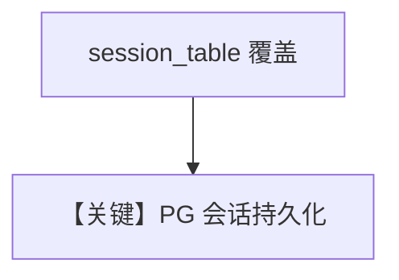

# storage.md — 实现原理分析

> 源文件：`cookbook/90_models/meta/llama_openai/storage.py`

## 概述

**`PostgresDb(..., session_table="llama_openai_sessions")` 自定义会话表名 + WebSearch + 历史**。

**核心配置一览：**

| 配置项 | 值 | 说明 |
|--------|-----|------|
| `model` | `LlamaOpenAI(id="Llama-4-Maverick-17B-128E-Instruct-FP8")` | OpenAI 兼容 |
| `db` | `PostgresDb(db_url=..., session_table="llama_openai_sessions")` | 自定义表 |
| `tools` | `[WebSearchTools()]` | 搜索 |
| `add_history_to_context` | `True` | 历史 |

## Mermaid 流程图

## 关键源码文件索引

| 文件 | 关键 |
|------|------|
| `agno/db/postgres.py` | `session_table` |
