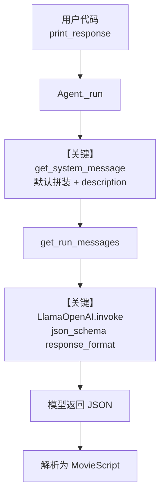

# structured_output.py — 实现原理分析

<!-- cookbook-py-source:start -->
## 完整源码

```python
"""
Meta Structured Output
======================

Cookbook example for `meta/llama_openai/structured_output.py`.
"""

from typing import List

from agno.agent import Agent, RunOutput  # noqa
from agno.models.meta import LlamaOpenAI
from pydantic import BaseModel, Field
from rich.pretty import pprint  # noqa

# ---------------------------------------------------------------------------
# Create Agent
# ---------------------------------------------------------------------------


class MovieScript(BaseModel):
    setting: str = Field(
        ..., description="Provide a nice setting for a blockbuster movie."
    )
    ending: str = Field(
        ...,
        description="Ending of the movie. If not available, provide a happy ending.",
    )
    genre: str = Field(
        ...,
        description="Genre of the movie. If not available, select action, thriller or romantic comedy.",
    )
    name: str = Field(..., description="Give a name to this movie")
    characters: List[str] = Field(..., description="Name of characters for this movie.")
    storyline: str = Field(
        ..., description="3 sentence storyline for the movie. Make it exciting!"
    )


# Agent that uses a JSON schema output
json_schema_output_agent = Agent(
    model=LlamaOpenAI(id="Llama-4-Maverick-17B-128E-Instruct-FP8", temperature=0.1),
    description="You are a helpful assistant. Summarize the movie script based on the location in a JSON object.",
    output_schema=MovieScript,
)

json_schema_output_agent.print_response("New York")

# ---------------------------------------------------------------------------
# Run Agent
# ---------------------------------------------------------------------------

if __name__ == "__main__":
    pass
```

<!-- cookbook-py-source:end -->

> 源文件：`cookbook/90_models/meta/llama_openai/structured_output.py`

## 概述

本示例展示 Agno 的 **`output_schema` + OpenAI 兼容 Chat Completions** 机制：通过 `LlamaOpenAI` 调用 Meta Llama API，用 Pydantic 模型约束返回结构，由模型适配器在请求侧注入 JSON Schema（`supports_json_schema_outputs=True`），系统侧通常不再重复拼接长 JSON 说明。

**核心配置一览：**

| 配置项 | 值 | 说明 |
|--------|------|------|
| `model` | `LlamaOpenAI(id="Llama-4-Maverick-17B-128E-Instruct-FP8", temperature=0.1)` | Chat Completions API（OpenAI 兼容） |
| `description` | `"You are a helpful assistant. Summarize the movie script based on the location in a JSON object."` | 写入默认 system 首段（`# 3.3.1`） |
| `output_schema` | `MovieScript` | Pydantic，驱动结构化输出 |
| `instructions` | `None` | 未设置 |
| `markdown` | `True`（默认） | 与 `output_schema` 同时存在时，附加信息中的 Markdown 提示不追加（见 `_messages.py` 中 `output_schema is None` 判断） |
| `tools` | `None` | 未设置 |
| `system_message` | `None` | 未设置，走默认拼装 |

## 架构分层

```
用户代码层                agno.agent 层
┌────────────────────────┐    ┌──────────────────────────────────────────┐
│ structured_output.py   │    │ Agent.run / print_response → _run()      │
│ LlamaOpenAI +          │───>│ get_system_message()（_messages.py）     │
│ output_schema=MovieScript │  │ get_run_messages() → 模型 invoke        │
└────────────────────────┘    └──────────────────────────────────────────┘
                                      │
                                      ▼
                        ┌─────────────────────────────┐
                        │ LlamaOpenAI（OpenAILike）    │
                        │ chat.completions.create     │
                        │ + response_format json_schema │
                        └─────────────────────────────┘
```

## 核心组件解析

### Agent 与结构化输出

`Agent` 将 `output_schema` 传入运行上下文；`get_system_message()` 在默认路径下按注释块 `# 3.3.1`～`# 3.3.16` 拼装内容。`LlamaOpenAI` 声明 `supports_json_schema_outputs=True`，在常见默认下 `# 3.3.15` 的 `get_json_output_prompt` 可能不追加（见 `agno/agent/_messages.py` 约 L425-L435 的条件）。

### 运行机制与因果链

1. **数据路径**：用户字符串（如 `"New York"`）→ `print_response` → `run` → 组装 `messages`（system + user）→ `LlamaOpenAI.invoke` → `chat.completions.create`，附带 `response_format` 的 JSON Schema。
2. **状态与副作用**：本示例无 `db`、无会话历史；不落库，无工具副作用。
3. **关键分支**：若设置 `system_message` 则早退（`get_system_message` L129-L152）；本示例未设置。若 `build_context=False` 则返回 `None`（L154-L156）；默认 `True`。
4. **定位**：在同目录 `tool_use.py` 侧重工具调用；本文件只演示 **Meta Llama + 结构化字段（电影剧本）**。

## System Prompt 组装

| 序号 | 组成部分 | 本文件中的值/来源 | 是否生效 |
|------|---------|------------------|---------|
| 1 | `description` | 见下「还原后的完整 System 文本」 | 是 |
| 2 | `role` | 未设置 | 否 |
| 3 | `instructions` | 未设置 | 否 |
| 4.1 | `markdown` 附加句 | 因存在 `output_schema`，不追加「Use markdown…」 | 否 |
| 5-12 | 记忆/知识/会话摘要等 | 未启用 | 否 |
| 动态 | 模型侧 system 片段 | `model.get_system_message_for_model`（若有） | 视模型实现 |
| 动态 | JSON 说明段 | `# 3.3.15` 在支持 JSON Schema 且条件满足时可能跳过 | 视分支 |

### 拼装顺序与源码锚点

1. `# 3.3.1` `description`（若存在）
2. `# 3.3.2` `role`（无）
3. `# 3.3.3` 合并后的 `instructions`（含 `model.get_instructions_for_model`，`# 3.1.1`）
4. `# 3.3.4` `additional_information`（本示例无 Markdown 行）
5. `# 3.3.5` 工具说明（无工具）
6. 后续段落至 `# 3.3.14` `get_system_message_for_model`
7. `# 3.3.15`-`# 3.3.16` 结构化输出补充（按条件）

### 还原后的完整 System 文本

本 run 用户消息取示例中的：`"New York"`。

```text
You are a helpful assistant. Summarize the movie script based on the location in a JSON object.
```

（若运行时仍追加模型内置说明或 JSON 引导，请以 `get_system_message()` 出口处实际 `Message.content` 为准；可在该函数返回前断点或临时打印验证。）

### 段落释义（模型视角）

- **description**：把任务限定为「按地点概括电影剧本」并暗示 JSON 形态。
- **与 API 侧 schema**：OpenAI 兼容层用 `response_format` 强制结构，模型需填满 `MovieScript` 各字段。

### 与 User / Developer 消息的边界

用户消息为纯文本查询（如 `"New York"`）；不含多模态。Llama 适配器通常将 system 作为 `system` 角色消息传入 Chat Completions。

## 完整 API 请求

```python
# LlamaOpenAI 继承 OpenAIChat：OpenAI Python SDK 的 chat.completions.create
# 以下为与一次典型 structured run 等价的形态（省略客户端认证细节）

client.chat.completions.create(
    model="Llama-4-Maverick-17B-128E-Instruct-FP8",
    messages=[
        # 来自 get_system_message() 的 system 文本
        {"role": "system", "content": "<见上一节还原文本及运行时动态段>"},
        {"role": "user", "content": "New York"},
    ],
    temperature=0.1,
    response_format={
        "type": "json_schema",
        "json_schema": {
            "name": "MovieScript",
            "schema": {...},  # 由 Pydantic 导出
            "strict": True,   # 取决于 OpenAIChat.strict_output 默认
        },
    },
)
```

> system 内容对应第五节「还原后的完整 System 文本」；`response_format` 来自 `OpenAIChat.get_request_params`（`agno/models/openai/chat.py`）。

## Mermaid 流程图



- **【关键】get_system_message**：写入 description 驱动的角色与任务。
- **【关键】LlamaOpenAI.invoke**：通过 Chat Completions + JSON Schema 约束输出形状。

## 关键源码文件索引

| 文件 | 关键函数/类 | 作用 |
|------|------------|------|
| `agno/agent/_messages.py` | `get_system_message()` L106-L450 | 默认 system 拼装与 `# 3.3.15` 结构化分支 |
| `agno/models/openai/chat.py` | `OpenAIChat.get_request_params` | `response_format` / `json_schema` |
| `agno/models/meta/llama_openai.py` | `LlamaOpenAI` L17-L79 | OpenAI 兼容端点与 `supports_json_schema_outputs` |
| `agno/agent/agent.py` | `Agent.run` / `print_response` L1089+ | 入口与运行循环 |
