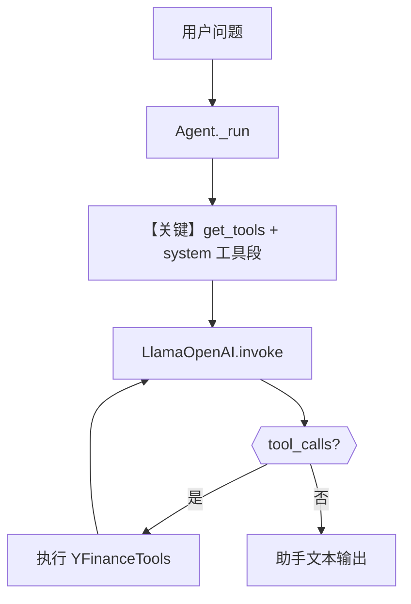

# tool_use.py — 实现原理分析

> 源文件：`cookbook/90_models/meta/llama_openai/tool_use.py`

## 概述

本示例展示 Agno 的 **`Agent` + `YFinanceTools` + `LlamaOpenAI`** 机制：通过 OpenAI 兼容接口调用 Meta Llama，由框架注册金融工具并在多轮中执行工具调用（含同步/异步与流式 `print_response`）。

**核心配置一览：**

| 配置项 | 值 | 说明 |
|--------|------|------|
| `model` | `LlamaOpenAI(id="Llama-4-Maverick-17B-128E-Instruct-FP8")` | Chat Completions API |
| `tools` | `[YFinanceTools()]` | 股价等工具 |
| `instructions` | `None` | 未设置 |
| `markdown` | `True`（默认） | 可能追加 Markdown 格式提示 |
| `description` | `None` | 未设置 |

## 架构分层

```
用户代码层                     agno.agent 层
┌─────────────────────┐       ┌────────────────────────────────────┐
│ tool_use.py         │       │ Agent._run → get_tools()          │
│ tools=YFinanceTools │──────>│ get_system_message（工具说明注入） │
│ print_response(...) │       │ Model.invoke（tools + tool_choice）│
└─────────────────────┘       └────────────────────────────────────┘
                                        │
                                        ▼
                              ┌──────────────────┐
                              │ LlamaOpenAI      │
                              │ chat.completions │
                              └──────────────────┘
```

## 核心组件解析

### YFinanceTools

工具模式由 `agno/agent/_tools.py` 等逻辑转为 OpenAI 格式 `tools` 数组；`get_system_message()` 在 `# 3.3.5` 注入 `_tool_instructions`（若存在）。

### 运行机制与因果链

1. **路径**：用户问股价 → 模型可能返回 `tool_calls` → 框架执行工具 → 结果写回消息 → 再次请求模型生成自然语言答案。
2. **副作用**：YFinance 访问外部行情接口；无本示例内建数据库写入。
3. **分支**：`stream=True` 时走流式解析；`asyncio.run(aprint_response)` 走异步客户端路径。
4. **定位**：相对 `structured_output.py`，本文件强调 **工具调用与多种调用方式**。

## System Prompt 组装

| 序号 | 组成部分 | 本文件中的值/来源 | 是否生效 |
|------|---------|------------------|---------|
| 1 | `description` | 无 | 否 |
| 2 | `instructions` | 无 | 否 |
| 3 | Markdown 附加 | 默认可能追加 | 是（若 `markdown=True` 且无 output_schema） |
| 4 | 工具说明 | YFinance 相关片段 | 是 |

### 拼装顺序与源码锚点

见 `get_system_message()`：`# 3.3.1` description → `# 3.3.3` instructions → `# 3.3.4` additional_information → `# 3.3.5` 工具说明（`agno/agent/_messages.py` L262-L265 起）。

### 还原后的完整 System 文本

静态字面量仅含框架默认段；工具与 Markdown 句由框架生成，无法仅凭 `.py` 逐字还原全文。验证方式：在 `get_system_message()` 返回前打印 `Message.content`。

### 段落释义（模型视角）

- 工具段约束模型在需要时发起 `function` 调用并传入合法参数。
- Markdown 段约束可读输出格式。

### 与 User 消息边界

用户消息示例：`"Whats the price of AAPL stock?"`（源码字符串）。

## 完整 API 请求

```python
# 典型非流式、已展开 tools 的请求形态
client.chat.completions.create(
    model="Llama-4-Maverick-17B-128E-Instruct-FP8",
    messages=[
        {"role": "system", "content": "<拼装后的 system，含工具说明>"},
        {"role": "user", "content": "Whats the price of AAPL stock?"},
    ],
    tools=[...],  # YFinance 工具 JSON
    tool_choice="auto",
)
```

## Mermaid 流程图



## 关键源码文件索引

| 文件 | 关键函数/类 | 作用 |
|------|------------|------|
| `agno/agent/_messages.py` | `get_system_message()` L106+ | 工具说明并入 system |
| `agno/agent/_tools.py` | `get_tools` 相关 | 工具 schema |
| `agno/models/meta/llama_openai.py` | `LlamaOpenAI` | 调用 Chat Completions |
