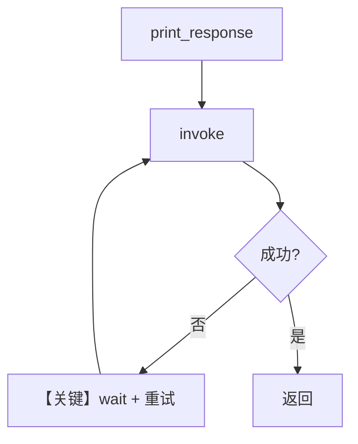

# retry.py — 实现原理分析

> 源文件：`cookbook/90_models/meta/retry.py`

## 概述

本示例展示 Agno 的 **模型层重试（`retries` / `delay_between_retries` / `exponential_backoff`）** 机制：故意使用错误 `id` 触发失败，由模型适配器在调用提供商 API 时按策略重试。

**核心配置一览：**

| 配置项 | 值 | 说明 |
|--------|------|------|
| `model` | `LlamaOpenAI(id=wrong_model_id, retries=3, delay_between_retries=1, exponential_backoff=True)` | 错误 id 触发失败与重试 |
| `instructions` / `tools` / `db` | `None` | 未设置 |

## 架构分层

```
用户代码层                 agno.agent 层
┌──────────────────┐      ┌─────────────────────────────┐
│ wrong_model_id   │      │ Agent.run → Model.invoke      │
│ print_response   │─────>│ 内部 HTTP/SDK 层重试循环       │
└──────────────────┘      └─────────────────────────────┘
                                    │
                                    ▼
                          ┌──────────────────┐
                          │ LlamaOpenAI 客户端 │
                          └──────────────────┘
```

## 核心组件解析

### 重试参数

重试行为由 `Model` 基类及 OpenAI 客户端配置传递；与 Agent 业务逻辑无关。

### 运行机制与因果链

1. **路径**：单次用户问题 → 多次底层请求直至成功或耗尽 `retries`。
2. **副作用**：无会话持久化；可能产生多次失败日志。
3. **分支**：`exponential_backoff=True` 时间隔倍增。
4. **定位**：与「正确模型 id」的 basic 示例对照，仅演示 **弹性调用**。

## System Prompt 组装

未自定义 `description`/`instructions`；默认 system 仅含框架默认段（如 Markdown 提示，若启用）。无单独业务字面量。

### 还原后的完整 System 文本

无用户提供的 `description`/`instructions` 字面量；完整文本依赖 `Agent` 默认值与 `get_system_message` 默认分支。验证：运行时打印 `get_system_message` 返回值。

用户消息示例：`"What is the capital of France?"`

## 完整 API 请求

每次重试均为同一形态的 `chat.completions.create`（模型 id 仍为错误的 `llama-wrong-id`），直至放弃。

## Mermaid 流程图



## 关键源码文件索引

| 文件 | 关键函数/类 | 作用 |
|------|------------|------|
| `agno/models/base.py` | `Model` 重试相关 | 请求层策略 |
| `agno/models/meta/llama_openai.py` | `LlamaOpenAI` | 客户端参数 |
