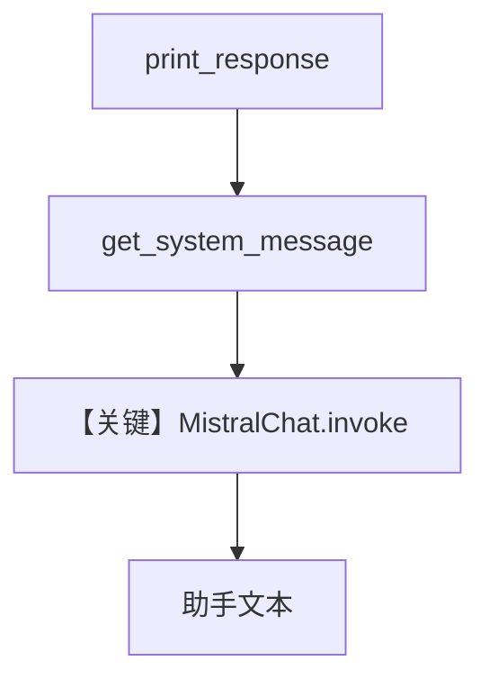

# basic.py — 实现原理分析

<!-- cookbook-py-source:start -->
## 完整源码

```python
"""
Mistral Basic
=============

Cookbook example for `mistral/basic.py`.
"""

from agno.agent import Agent, RunOutput  # noqa
from agno.models.mistral import MistralChat

# ---------------------------------------------------------------------------
# Create Agent
# ---------------------------------------------------------------------------

agent = Agent(
    model=MistralChat(id="mistral-small-latest"),
    markdown=True,
)

# Get the response in a variable
# run: RunOutput = agent.run("Share a 2 sentence horror story")
# print(run.content)

# Print the response in the terminal

# ---------------------------------------------------------------------------
# Run Agent
# ---------------------------------------------------------------------------
if __name__ == "__main__":
    # --- Sync ---
    agent.print_response("Share a 2 sentence horror story")

    # --- Sync + Streaming ---
    agent.print_response("Share a 2 sentence horror story", stream=True)
```

<!-- cookbook-py-source:end -->

> 源文件：`cookbook/90_models/mistral/basic.py`

## 概述

本示例展示 Agno 的 **`MistralChat` + Chat Completions（Mistral SDK）** 与 **`markdown=True`** 的最小对话：无工具、无结构化输出，演示同步/流式 `print_response`。

**核心配置一览：**

| 配置项 | 值 | 说明 |
|--------|------|------|
| `model` | `MistralChat(id="mistral-small-latest")` | Mistral `chat.complete` / `stream` |
| `markdown` | `True` | 附加 Markdown 使用说明（无 output_schema 时） |
| `instructions` | `None` | 未设置 |
| `tools` | `None` | 未设置 |

## 架构分层

```
用户代码层              agno.agent 层
┌────────────────┐     ┌──────────────────────────────┐
│ Agent(...)     │     │ _run → get_system_message    │
│ print_response │────>│ get_run_messages → invoke    │
└────────────────┘     └──────────────────────────────┘
                                │
                                ▼
                       ┌─────────────────┐
                       │ MistralChat     │
                       │ chat.complete   │
                       └─────────────────┘
```

## 核心组件解析

### MistralChat

`invoke()` 在 `agno/models/mistral/mistral.py` 约 L162 起调用 `get_client().chat.complete(...)`。

### 运行机制与因果链

1. **路径**：用户 horror story 提示 → 单轮补全（可流式）。
2. **副作用**：无 db/记忆。
3. **分支**：`stream=True` 走 `invoke_stream`。
4. **定位**：同目录其它文件在 basic 之上叠加图像、工具、结构化输出等。

## System Prompt 组装

| 组成部分 | 状态 |
|----------|------|
| `description` | 未设置 |
| `instructions` | 未设置 |
| `markdown` 附加句 | 生效（`# 3.2.1`，`_messages.py` L184-L186） |

### 拼装顺序与源码锚点

`# 3.3.1` 无 description → `# 3.3.3` 仅模型 instructions → `# 3.3.4` 含「Use markdown…」。

### 还原后的完整 System 文本

无用户字面 description/instructions。静态可预期段包含：

```text
Use markdown to format your answers.
```

（完整内容以运行时 `get_system_message()` 为准，可能含 `model.get_instructions_for_model` 输出。）

用户消息示例：`"Share a 2 sentence horror story"`

### 段落释义

- Markdown 句要求助手用 Markdown 排版，便于终端 `print_response` 渲染。

## 完整 API 请求

```python
# agno/models/mistral/mistral.py invoke
client.chat.complete(
    model="mistral-small-latest",
    messages=[...],  # format_messages 转换
    # temperature 等来自 get_request_params
)
```

## Mermaid 流程图



## 关键源码文件索引

| 文件 | 关键函数/类 | 作用 |
|------|------------|------|
| `agno/agent/_messages.py` | `get_system_message()` L106+ | 默认 system |
| `agno/models/mistral/mistral.py` | `MistralChat.invoke` L162+ | Mistral API |
