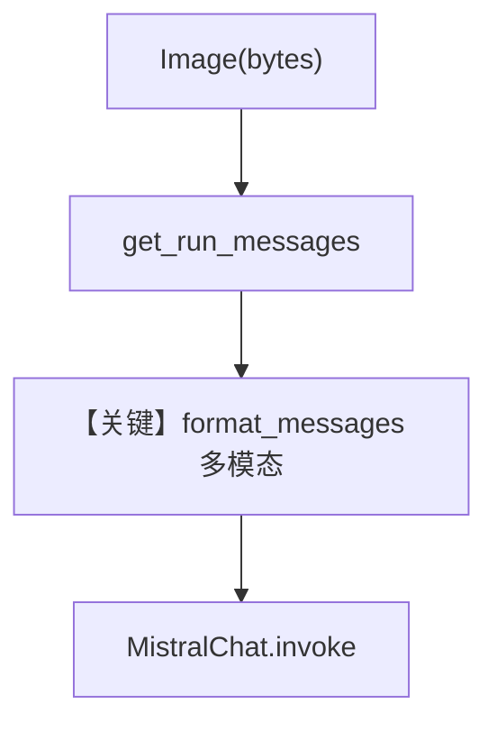

# image_bytes_input_agent.py — 实现原理分析

> 源文件：`cookbook/90_models/mistral/image_bytes_input_agent.py`

## 概述

本示例展示 Agno 的 **多模态消息（`Image(content=bytes)`）+ Pixtral 视觉模型** 机制：用 `requests` 拉取图片字节，经 `MistralChat` 发往 Mistral 多模态 Chat API。

**核心配置一览：**

| 配置项 | 值 | 说明 |
|--------|------|------|
| `model` | `MistralChat(id="pixtral-12b-2409")` | 视觉模型 |
| `markdown` | `True` | 默认 Markdown 提示 |

## 架构分层

用户层提供 `images=[Image(content=...)]` → `get_run_messages` 将图像编码进用户消息 → `MistralChat.invoke` → `format_messages`。

## 核心组件解析

### Image 与字节

`Image(content=image_bytes_from_url)` 由媒体层转为模型可消费的附件格式（见 `format_messages` / Mistral 侧约定）。

### 运行机制与因果链

1. **路径**：下载 JPEG → 作为用户消息图像部分 → 模型描述图像。
2. **副作用**：网络请求下载图片；无持久化。
3. **与 basic 差异**：用户消息含 **图像模态**。

## System Prompt 组装

无自定义 description/instructions；含 Markdown 默认句（若拼装路径启用）。

### 还原后的完整 System 文本

```text
Use markdown to format your answers.
```

（另含模型侧 instructions 时以运行时为准。）

用户消息：`"Tell me about this image."` + 图像附件。

## 完整 API 请求

Mistral `chat.complete`，`messages` 中含多模态 user 内容（文本 + 图像）。

## Mermaid 流程图



## 关键源码文件索引

| 文件 | 关键函数/类 | 作用 |
|------|------------|------|
| `agno/utils/models/mistral.py` | `format_messages` | 消息格式 |
| `agno/models/mistral/mistral.py` | `MistralChat.invoke` | API 调用 |
