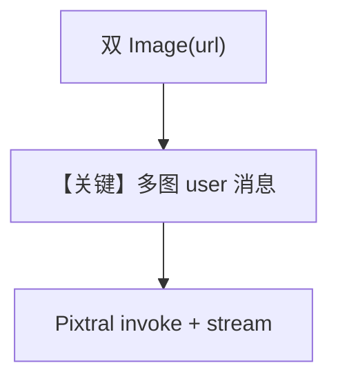

# image_compare_agent.py — 实现原理分析

> 源文件：`cookbook/90_models/mistral/image_compare_agent.py`

## 概述

本示例展示 **双图对比**：两条 `Image(url=...)` 与用户问题一并送入 `pixtral-12b-2409`，流式输出差异分析。

**核心配置一览：**

| 配置项 | 值 | 说明 |
|--------|------|------|
| `model` | `MistralChat(id="pixtral-12b-2409")` | 视觉 |
| `markdown` | `True` | 默认 |

## 核心组件解析

### 运行机制与因果链

用户消息同时携带两张图；模型在单轮内完成比较。`stream=True` 启用流式 token。

## System Prompt 组装

无业务 description；默认 Markdown 提示可能生效。

### 还原后的完整 System 文本

```text
Use markdown to format your answers.
```

用户消息：`"what are the differences between two images?"` + 两幅 URL 图像。

## 完整 API 请求

`chat.complete` 或 `stream`，messages 含多图 user payload。

## Mermaid 流程图



## 关键源码文件索引

| 文件 | 作用 |
|------|------|
| `agno/agent/_messages.py` | `get_run_messages` 组装多模态 |
| `agno/models/mistral/mistral.py` | `invoke_stream` |
