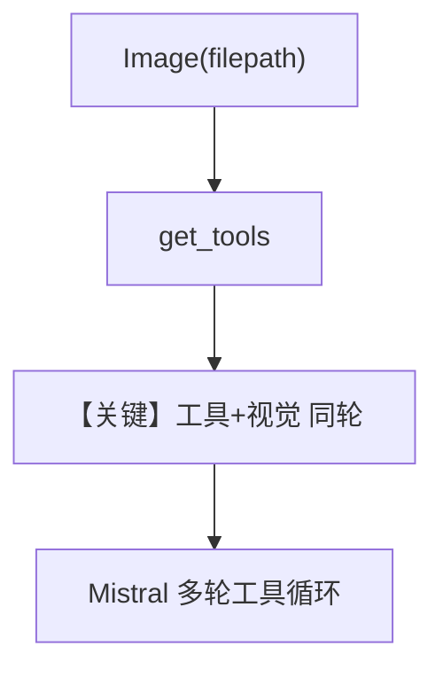

# image_file_input_agent.py — 实现原理分析

<!-- cookbook-py-source:start -->
## 完整源码

```python
"""
Mistral Image File Input Agent
==============================

Cookbook example for `mistral/image_file_input_agent.py`.
"""

from pathlib import Path

from agno.agent import Agent
from agno.media import Image
from agno.models.mistral.mistral import MistralChat
from agno.tools.websearch import WebSearchTools

# ---------------------------------------------------------------------------
# Create Agent
# ---------------------------------------------------------------------------

agent = Agent(
    model=MistralChat(id="pixtral-12b-2409"),
    tools=[
        WebSearchTools()
    ],  # pixtral-12b-2409 is not so great at tool calls, but it might work.
    markdown=True,
)

image_path = Path(__file__).parent.joinpath("sample.jpeg")

agent.print_response(
    "Tell me about this image and give me the latest news about it from duckduckgo.",
    images=[
        Image(filepath=image_path),
    ],
    stream=True,
)

# ---------------------------------------------------------------------------
# Run Agent
# ---------------------------------------------------------------------------

if __name__ == "__main__":
    pass
```

<!-- cookbook-py-source:end -->

> 源文件：`cookbook/90_models/mistral/image_file_input_agent.py`

## 概述

本示例展示 **本地图像文件 `Image(filepath)` + WebSearchTools**：Pixtral 读图，DuckDuckGo 工具拉新闻，演示视觉与搜索组合（注释提示该模型工具能力有限）。

**核心配置一览：**

| 配置项 | 值 | 说明 |
|--------|------|------|
| `model` | `MistralChat(id="pixtral-12b-2409")` | 视觉 |
| `tools` | `[WebSearchTools()]` | 网络搜索 |
| `markdown` | `True` | 默认 |

## 核心组件解析

工具调用与图像输入共存：system 含工具说明；用户消息含图像与复合指令。

### 运行机制与因果链

路径：描述图像 + 搜索「duckduckgo」相关新闻 → 可能多轮工具调用。

## System Prompt 组装

含工具 instruction 段（`# 3.3.5`）及默认 Markdown 句。

### 用户消息（参照）

`"Tell me about this image and give me the latest news about it from duckduckgo."` + `sample.jpeg`

## 完整 API 请求

`chat.complete` + `tools` 数组 + 多模态 user 消息。

## Mermaid 流程图



## 关键源码文件索引

| 文件 | 作用 |
|------|------|
| `agno/agent/_messages.py` | 工具并入 system |
| `agno/models/mistral/mistral.py` | `invoke` / 流式 |
