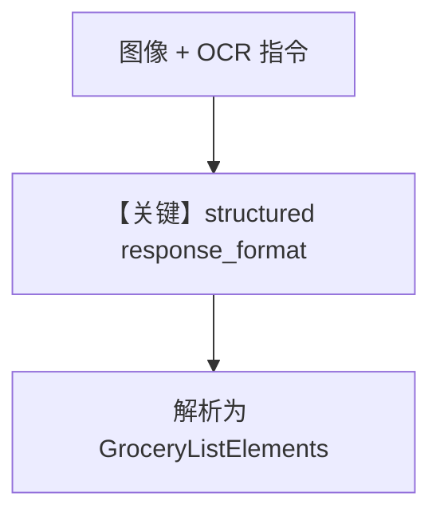

# image_ocr_with_structured_output.py — 实现原理分析

<!-- cookbook-py-source:start -->
## 完整源码

```python
"""
Mistral Image Ocr With Structured Output
========================================

Cookbook example for `mistral/image_ocr_with_structured_output.py`.
"""

from typing import List

from agno.agent import Agent
from agno.media import Image
from agno.models.mistral.mistral import MistralChat
from pydantic import BaseModel

# ---------------------------------------------------------------------------
# Create Agent
# ---------------------------------------------------------------------------


class GroceryItem(BaseModel):
    item_name: str
    price: float


class GroceryListElements(BaseModel):
    bill_number: str
    items: List[GroceryItem]
    total_price: float


agent = Agent(
    model=MistralChat(id="pixtral-12b-2409"),
    instructions=[
        "Extract the text elements described by the user from the picture",
    ],
    output_schema=GroceryListElements,
    markdown=True,
)

agent.print_response(
    "From this restaurant bill, extract the bill number, item names and associated prices, and total price and return it as a string in a Json object",
    images=[Image(url="https://i.imghippo.com/files/kgXi81726851246.jpg")],
)

# ---------------------------------------------------------------------------
# Run Agent
# ---------------------------------------------------------------------------

if __name__ == "__main__":
    pass
```

<!-- cookbook-py-source:end -->

> 源文件：`cookbook/90_models/mistral/image_ocr_with_structured_output.py`

## 概述

本示例展示 **`output_schema` + 图像输入**：从账单图 OCR 并解析为 `GroceryListElements`（Pydantic），`MistralChat` 在支持原生结构化输出时走 API 侧 schema（`supports_native_structured_outputs=True`）。

**核心配置一览：**

| 配置项 | 值 | 说明 |
|--------|------|------|
| `model` | `MistralChat(id="pixtral-12b-2409")` | 视觉 + 结构化 |
| `instructions` | 列表含「Extract the text elements…」 | 进入 `# 3.3.3` |
| `output_schema` | `GroceryListElements` | 结构化输出 |
| `markdown` | `True` | 与 output_schema 并存时跳过 Markdown 附加句 |

## 核心组件解析

### 运行机制与因果链

1. 用户消息含图像 URL + 提取需求 → 模型输出符合 schema 的 JSON。
2. **分支**：`invoke` 在 `response_format` 为 Pydantic 时走 `response_format_from_pydantic_model`（`mistral.py` L178-L190）。

## System Prompt 组装

| 组成部分 | 状态 |
|----------|------|
| `instructions` | 生效，字面量见下 |

### 还原后的完整 System 文本（instructions 原样）

```text
- Extract the text elements described by the user from the picture
```

（前后另有 description 无；完整 system 另含 `# 3.3.14` 模型段及可能的 JSON 引导，视 `# 3.3.15` 条件。）

用户消息：长英文指令 + `Image(url=...)`

## 完整 API 请求

`chat.complete` with `response_format` from Pydantic + 多模态 messages。

## Mermaid 流程图



## 关键源码文件索引

| 文件 | 作用 |
|------|------|
| `agno/models/mistral/mistral.py` | `invoke` L178-190 structured 分支 |
| `agno/agent/_messages.py` | `get_system_message` 与 output_schema |
