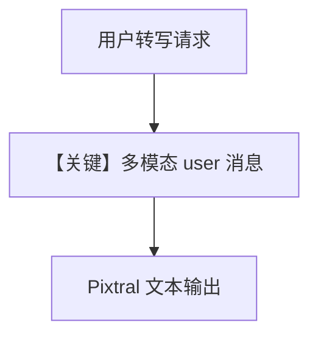

# image_transcribe_document_agent.py — 实现原理分析

<!-- cookbook-py-source:start -->
## 完整源码

```python
"""
This agent transcribes an old written document from an image.
"""

from agno.agent import Agent
from agno.media import Image
from agno.models.mistral.mistral import MistralChat

# ---------------------------------------------------------------------------
# Create Agent
# ---------------------------------------------------------------------------

agent = Agent(
    model=MistralChat(id="pixtral-12b-2409"),
    markdown=True,
)

agent.print_response(
    "Transcribe this document.",
    images=[
        Image(url="https://ciir.cs.umass.edu/irdemo/hw-demo/page_example.jpg"),
    ],
)

# ---------------------------------------------------------------------------
# Run Agent
# ---------------------------------------------------------------------------

if __name__ == "__main__":
    pass
```

<!-- cookbook-py-source:end -->

> 源文件：`cookbook/90_models/mistral/image_transcribe_document_agent.py`

## 概述

本示例展示 **历史手写文档图像转写**：单轮用户消息含 `Image(url)` 与「Transcribe this document.」，无工具、无结构化 schema。

**核心配置一览：**

| 配置项 | 值 | 说明 |
|--------|------|------|
| `model` | `MistralChat(id="pixtral-12b-2409")` | 视觉 |
| `markdown` | `True` | 默认 |

## System Prompt 组装

无自定义 description/instructions 字面量。

### 还原后的完整 System 文本

```text
Use markdown to format your answers.
```

用户消息：`"Transcribe this document."` + 文档图像 URL。

## 完整 API 请求

多模态 `chat.complete`，无 tools。

## Mermaid 流程图



## 关键源码文件索引

| 文件 | 作用 |
|------|------|
| `agno/models/mistral/mistral.py` | `MistralChat.invoke` |
