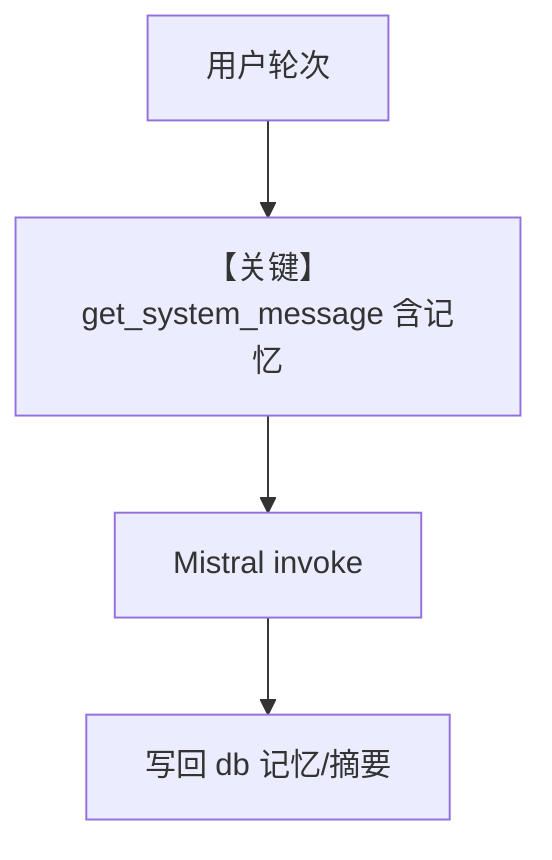

# memory.py — 实现原理分析

<!-- cookbook-py-source:start -->
## 完整源码

```python
"""
This recipe shows how to use personalized memories and summaries in an agent.
Steps:
1. Run: `./cookbook/scripts/run_pgvector.sh` to start a postgres container with pgvector
2. Run: `uv pip install mistralai sqlalchemy 'psycopg[binary]' pgvector` to install the dependencies
3. Run: `python cookbook/92_models/mistral/memory.py` to run the agent
"""

from agno.agent import Agent
from agno.db.postgres import PostgresDb
from agno.models.mistral.mistral import MistralChat
from agno.tools.websearch import WebSearchTools

# ---------------------------------------------------------------------------
# Create Agent
# ---------------------------------------------------------------------------

db_url = "postgresql+psycopg://ai:ai@localhost:5532/ai"
# Setup the database
db = PostgresDb(db_url=db_url)

agent = Agent(
    model=MistralChat(id="mistral-large-latest"),
    tools=[WebSearchTools()],
    # Pass the database to the Agent
    db=db,
    # Enable user memories
    update_memory_on_run=True,
    # Enable session summaries
    enable_session_summaries=True,
    # Show debug logs so, you can see the memory being created
)

# -*- Share personal information
agent.print_response("My name is john billings?", stream=True)

# -*- Share personal information
agent.print_response("I live in nyc?", stream=True)

# -*- Share personal information
agent.print_response("I'm going to a concert tomorrow?", stream=True)

# -*- Make tool call
agent.print_response("What is the weather in nyc?", stream=True)

# Ask about the conversation
agent.print_response(
    "What have we been talking about, do you know my name?", stream=True
)

# ---------------------------------------------------------------------------
# Run Agent
# ---------------------------------------------------------------------------

if __name__ == "__main__":
    pass
```

<!-- cookbook-py-source:end -->

> 源文件：`cookbook/90_models/mistral/memory.py`

## 概述

本示例展示 **`PostgresDb` + `update_memory_on_run` + `enable_session_summaries`**：在 PostgreSQL 中持久化用户记忆与会话摘要，并配合 `WebSearchTools` 演示多轮对话与工具调用。

**核心配置一览：**

| 配置项 | 值 | 说明 |
|--------|------|------|
| `model` | `MistralChat(id="mistral-large-latest")` | Chat Completions |
| `db` | `PostgresDb(db_url=...)` | 持久化 |
| `tools` | `[WebSearchTools()]` | 搜索 |
| `update_memory_on_run` | `True` | 运行后更新记忆 |
| `enable_session_summaries` | `True` | 会话摘要 |

## 核心组件解析

### 记忆与摘要

`get_system_message()` 在启用记忆时追加 `# 3.3.9` 段（`_messages.py` L286+）；`memory_manager` 可能由框架惰性初始化。

### 运行机制与因果链

1. **路径**：多轮 `print_response` → 写入记忆/摘要 → 后续轮次 system 含记忆列表。
2. **副作用**：**写入 PostgreSQL**；需本地 pg 与依赖。
3. **定位**：相对 `basic.py`，强调 **生产型存储 + 记忆**。

## System Prompt 组装

随轮次变化：首轮可能提示「尚无记忆」；后续含 `<memories_from_previous_interactions>` 列表。无法静态还原全文。

### 验证方式

在 `get_system_message()` 返回前打印 `content`，或开启 debug 查看记忆写入。

用户消息示例：`"My name is john billings?"` 等。

## 完整 API 请求

每轮均为 `chat.complete` + tools + 当前拼装 system（含记忆段）。

## Mermaid 流程图



## 关键源码文件索引

| 文件 | 作用 |
|------|------|
| `agno/agent/_messages.py` | `# 3.3.9` memories |
| `agno/db/postgres` | `PostgresDb` |
