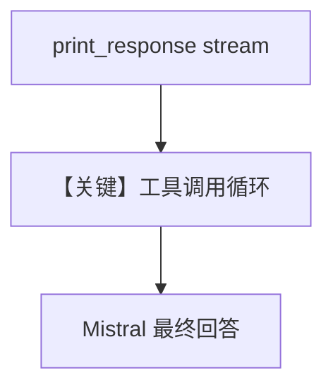

# mistral_small.py — 实现原理分析

> 源文件：`cookbook/90_models/mistral/mistral_small.py`

## 概述

本示例展示 **`mistral-small-latest` + WebSearchTools** 流式查询新闻，依赖注释中的 `ddgs` 安装。

**核心配置一览：**

| 配置项 | 值 | 说明 |
|--------|------|------|
| `model` | `MistralChat(id="mistral-small-latest")` | Chat |
| `tools` | `[WebSearchTools()]` | 搜索 |
| `markdown` | `True` | 默认 |

## System Prompt 组装

无用户 description；含工具说明与可能的 Markdown 句。

### 用户消息

`"Tell me about mistrall small, any news"`（源码拼写 mistroll）

## 完整 API 请求

`chat.complete` / stream，`tools` 已注册。

## Mermaid 流程图

## 关键源码文件索引

| 文件 | 作用 |
|------|------|
| `agno/models/mistral/mistral.py` | `invoke` / stream |
