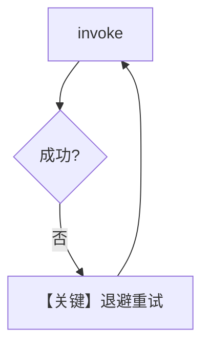

# retry.py — 实现原理分析

<!-- cookbook-py-source:start -->
## 完整源码

```python
"""Example demonstrating how to set up retries with Mistral."""

from agno.agent import Agent
from agno.models.mistral import MistralChat

# ---------------------------------------------------------------------------
# Create Agent
# ---------------------------------------------------------------------------

# We will use a deliberately wrong model ID, to trigger retries.
wrong_model_id = "mistral-wrong-id"

agent = Agent(
    model=MistralChat(
        id=wrong_model_id,
        retries=3,  # Number of times to retry the request.
        delay_between_retries=1,  # Delay between retries in seconds.
        exponential_backoff=True,  # If True, the delay between retries is doubled each time.
    ),
)

agent.print_response("What is the capital of France?")

# ---------------------------------------------------------------------------
# Run Agent
# ---------------------------------------------------------------------------

if __name__ == "__main__":
    pass
```

<!-- cookbook-py-source:end -->

> 源文件：`cookbook/90_models/mistral/retry.py`

## 概述

本示例展示 **Mistral 模型层重试**：故意使用 `mistral-wrong-id` 触发 API 失败，由 `retries` / `delay_between_retries` / `exponential_backoff` 控制重试行为。

**核心配置一览：**

| 配置项 | 值 | 说明 |
|--------|------|------|
| `model` | `MistralChat(id=wrong_model_id, retries=3, delay_between_retries=1, exponential_backoff=True)` | 错误 id + 重试 |

## 架构分层

```
用户 print_response → Agent._run → MistralChat.invoke
        → Mistral SDK 层失败 → 按策略重试
```

## 核心组件解析

### 运行机制与因果链

1. 单次提问触发链式底层请求直至成功或耗尽次数。
2. 无 db/工具副作用。

## System Prompt 组装

无 `description`/`instructions` 字面量。

### 还原后的完整 System 文本

以运行时 `get_system_message()` 为准；可含默认 Markdown 句。验证：返回前打印 `Message.content`。

用户消息：`"What is the capital of France?"`

## 完整 API 请求

重复形态的 `chat.complete(model="mistral-wrong-id", ...)`。

## Mermaid 流程图



## 关键源码文件索引

| 文件 | 作用 |
|------|------|
| `agno/models/mistral/mistral.py` | `MistralChat` / 客户端 |
