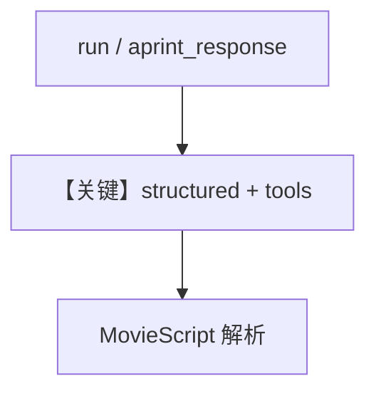

# structured_output.py — 实现原理分析

<!-- cookbook-py-source:start -->
## 完整源码

```python
"""
Mistral Structured Output
=========================

Cookbook example for `mistral/structured_output.py`.
"""

import asyncio
from typing import List

from agno.agent import Agent, RunOutput  # noqa
from agno.models.mistral import MistralChat
from agno.tools.websearch import WebSearchTools
from pydantic import BaseModel, Field
from rich.pretty import pprint  # noqa

# ---------------------------------------------------------------------------
# Create Agent
# ---------------------------------------------------------------------------


class MovieScript(BaseModel):
    setting: str = Field(
        ..., description="Provide a nice setting for a blockbuster movie."
    )
    ending: str = Field(
        ...,
        description="Ending of the movie. If not available, provide a happy ending.",
    )
    genre: str = Field(
        ...,
        description="Genre of the movie. If not available, select action, thriller or romantic comedy.",
    )
    name: str = Field(..., description="Give a name to this movie")
    characters: List[str] = Field(..., description="Name of characters for this movie.")
    storyline: str = Field(
        ..., description="3 sentence storyline for the movie. Make it exciting!"
    )


structured_output_agent = Agent(
    model=MistralChat(
        id="mistral-large-latest",
    ),
    tools=[WebSearchTools()],
    description="You help people write movie scripts.",
    output_schema=MovieScript,
)

# Get the response in a variable
structured_output_response: RunOutput = structured_output_agent.run("New York")
pprint(structured_output_response.content)

# ---------------------------------------------------------------------------
# Run Agent
# ---------------------------------------------------------------------------
if __name__ == "__main__":
    # --- Async ---
    asyncio.run(
        structured_output_agent.aprint_response(
            "Find a cool movie idea about London and write it."
        )
    )
```

<!-- cookbook-py-source:end -->

> 源文件：`cookbook/90_models/mistral/structured_output.py`

## 概述

本示例展示 **`output_schema=MovieScript` + WebSearchTools**：先 `run`+`pprint` 同步结果，再在 `__main__` 中 `aprint_response` 异步流式；模型为 `mistral-large-latest`。

**核心配置一览：**

| 配置项 | 值 | 说明 |
|--------|------|------|
| `model` | `MistralChat(id="mistral-large-latest")` | 结构化 + 工具 |
| `tools` | `[WebSearchTools()]` | 可搜索素材 |
| `description` | `"You help people write movie scripts."` | 字面量 |
| `output_schema` | `MovieScript` | Pydantic |

## System Prompt 组装

### 还原后的完整 System 文本（用户字面量）

```text
You help people write movie scripts.
```

（另含 instructions 列表合并、工具说明、模型 instructions；`# 3.3.15` 视 Mistral 原生 structured 支持可能省略长 JSON 提示。）

用户消息示例：`"New York"` 与 `"Find a cool movie idea about London and write it."`

## 完整 API 请求

`chat.complete` + `tools` + `response_format`（Pydantic）参见 `mistral.py` L178-190。

## Mermaid 流程图



## 关键源码文件索引

| 文件 | 作用 |
|------|------|
| `agno/models/mistral/mistral.py` | structured `invoke` |
| `agno/agent/_messages.py` | system 拼装 |
