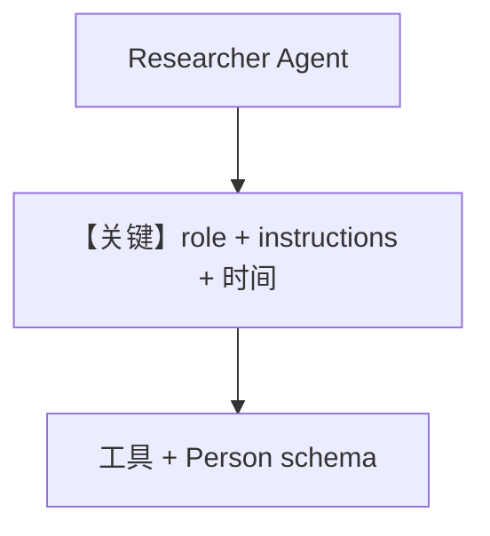

# structured_output_with_tool_use.py — 实现原理分析

<!-- cookbook-py-source:start -->
## 完整源码

```python
"""
Mistral Structured Output With Tool Use
=======================================

Cookbook example for `mistral/structured_output_with_tool_use.py`.
"""

from agno.agent import Agent
from agno.models.mistral import MistralChat
from agno.tools.websearch import WebSearchTools
from pydantic import BaseModel

# ---------------------------------------------------------------------------
# Create Agent
# ---------------------------------------------------------------------------


class Person(BaseModel):
    name: str
    description: str


model = MistralChat(
    id="mistral-medium-latest",
    temperature=0.0,
)

researcher = Agent(
    name="Researcher",
    model=model,
    role="You find people with a specific role at a provided company.",
    instructions=[
        "- Search the web for the person described"
        "- Find out if they have public contact details"
        "- Return the information in a structured format"
    ],
    tools=[WebSearchTools()],
    output_schema=Person,
    add_datetime_to_context=True,
)

researcher.print_response("Find information about Elon Musk")

# ---------------------------------------------------------------------------
# Run Agent
# ---------------------------------------------------------------------------

if __name__ == "__main__":
    pass
```

<!-- cookbook-py-source:end -->

> 源文件：`cookbook/90_models/mistral/structured_output_with_tool_use.py`

## 概述

本示例展示 **命名 Agent + `role` + `instructions` + 工具 + `output_schema` + `add_datetime_to_context`**：`Researcher` 搜索并返回 `Person` 结构。

**核心配置一览：**

| 配置项 | 值 | 说明 |
|--------|------|------|
| `name` | `"Researcher"` | Agent 名 |
| `model` | `MistralChat(id="mistral-medium-latest", temperature=0.0)` | 低温度 |
| `role` | `"You find people with a specific role at a provided company."` | `# 3.3.2` |
| `instructions` | 三条字符串（搜索、联系方式、结构化） | `# 3.3.3` |
| `tools` | `[WebSearchTools()]` | 搜索 |
| `output_schema` | `Person` | 结构化 |
| `add_datetime_to_context` | `True` | `# 3.2.2` 当前时间 |

## System Prompt 组装

### 还原后的完整 System 文本（用户可静态还原部分）

本示例未设置 `description`。`role` 进入 `<your_role>`（`_messages.py` L237-L239）。`instructions` 为多条时按 `# 3.3.3` 以 `- ` 行列出：

```text

<your_role>
You find people with a specific role at a provided company.
</your_role>

- Search the web for the person described
- Find out if they have public contact details
- Return the information in a structured format

```

段前可能还有换行衔接；另追加 `<additional_information>` 中的当前时间（动态）及工具说明。

另含 `<additional_information>` 中的当前时间句（动态）与工具说明。

用户消息：`"Find information about Elon Musk"`

## 完整 API 请求

带 tools 与 `response_format`=`Person` 的 `chat.complete`。

## Mermaid 流程图



## 关键源码文件索引

| 文件 | 作用 |
|------|------|
| `agno/agent/_messages.py` | L237-L239 `role` 标签 |
| `agno/models/mistral/mistral.py` | `invoke` |
