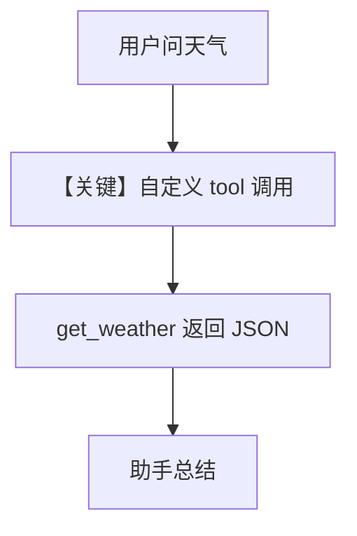

# tool_use.py — 实现原理分析

<!-- cookbook-py-source:start -->
## 完整源码

```python
"""Mistral tool use example with a custom function tool."""

import asyncio
import json

from agno.agent import Agent
from agno.models.mistral import MistralChat
from agno.tools import tool

# ---------------------------------------------------------------------------
# Define a tool
# ---------------------------------------------------------------------------


@tool
def get_weather(city: str) -> str:
    """Get the current weather for a city.

    Args:
        city: The city name to get weather for.
    """
    weather_data = {
        "Paris": {"temp": 18, "condition": "cloudy", "humidity": 65},
        "London": {"temp": 14, "condition": "rainy", "humidity": 80},
        "Tokyo": {"temp": 22, "condition": "sunny", "humidity": 50},
        "New York": {"temp": 20, "condition": "partly cloudy", "humidity": 55},
    }
    data = weather_data.get(city, {"temp": 20, "condition": "unknown", "humidity": 50})
    return json.dumps(data)


# ---------------------------------------------------------------------------
# Create Agent
# ---------------------------------------------------------------------------

agent = Agent(
    model=MistralChat(id="mistral-large-latest"),
    tools=[get_weather],
    markdown=True,
)

# ---------------------------------------------------------------------------
# Run Agent
# ---------------------------------------------------------------------------
if __name__ == "__main__":
    # --- Sync ---
    agent.print_response("What is the weather in Paris and Tokyo?")

    # --- Async ---
    asyncio.run(agent.aprint_response("What is the weather in London and New York?"))
```

<!-- cookbook-py-source:end -->

> 源文件：`cookbook/90_models/mistral/tool_use.py`

## 概述

本示例展示 **`@tool` 自定义函数 `get_weather` + `MistralChat`**，同步与异步 `print_response` 调用天气查询。

**核心配置一览：**

| 配置项 | 值 | 说明 |
|--------|------|------|
| `model` | `MistralChat(id="mistral-large-latest")` | Chat |
| `tools` | `[get_weather]` | 自定义 Python 工具 |
| `markdown` | `True` | 默认 |

## 核心组件解析

`get_weather` 经 `Function` 包装为 JSON schema，进入 `tools` 与 system 工具说明段。

### 运行机制与因果链

模型对 Paris/Tokyo 等生成 tool_calls → 执行本地 dict 查找 → 返回 JSON 字符串给模型 → 自然语言总结。

用户消息：`"What is the weather in Paris and Tokyo?"` / `"What is the weather in London and New York?"`

## System Prompt 组装

无 description；含工具 schema 说明与 Markdown 句。

## 完整 API 请求

`chat.complete` with `tools=[{function: get_weather ...}]`。

## Mermaid 流程图



## 关键源码文件索引

| 文件 | 作用 |
|------|------|
| `agno/tools/function.py` | `Function` / `@tool` |
| `agno/models/mistral/mistral.py` | `invoke` |
