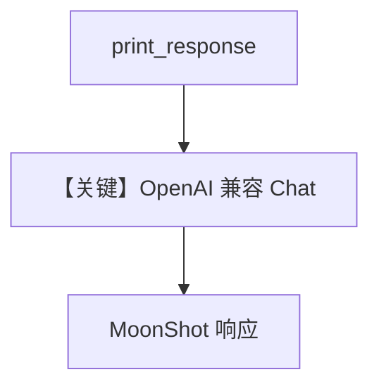

# basic.py — 实现原理分析

<!-- cookbook-py-source:start -->
## 完整源码

```python
"""
Moonshot Basic
==============

Cookbook example for `moonshot/basic.py`.
"""

from agno.agent import Agent
from agno.models.moonshot import MoonShot

# ---------------------------------------------------------------------------
# Create Agent
# ---------------------------------------------------------------------------

agent = Agent(model=MoonShot(id="kimi-k2-thinking"), markdown=True)

# ---------------------------------------------------------------------------
# Run Agent
# ---------------------------------------------------------------------------
if __name__ == "__main__":
    # --- Sync ---
    agent.print_response("Share a 2 sentence horror story.")

    # --- Sync + Streaming ---
    agent.print_response("Share a 2 sentence horror story.", stream=True)
```

<!-- cookbook-py-source:end -->

> 源文件：`cookbook/90_models/moonshot/basic.py`

## 概述

本示例展示 **`MoonShot`（Kimi）+ `markdown=True`** 的最小对话，同步与流式 `print_response`。

**核心配置一览：**

| 配置项 | 值 | 说明 |
|--------|------|------|
| `model` | `MoonShot(id="kimi-k2-thinking")` | OpenAI 兼容 Chat Completions |
| `markdown` | `True` | 默认 Markdown 提示 |

## 架构分层

用户代码 → `Agent._run` → `get_system_message` → `MoonShot`（`OpenAILike`）→ `chat.completions.create`。

## 核心组件解析

`MoonShot` 继承 `OpenAILike`/`OpenAIChat`，走标准 messages + 可选流式。

### 运行机制与因果链

单轮 horror story；无工具、无 db。

## System Prompt 组装

无用户 description/instructions。

### 还原后的完整 System 文本

```text
Use markdown to format your answers.
```

用户消息：`"Share a 2 sentence horror story."`

## 完整 API 请求

OpenAI Python SDK 形态：`client.chat.completions.create(model="kimi-k2-thinking", messages=[...])`。

## Mermaid 流程图



## 关键源码文件索引

| 文件 | 作用 |
|------|------|
| `agno/models/openai/chat.py` | `OpenAIChat.get_request_params` |
| `agno/agent/_messages.py` | `get_system_message` |
