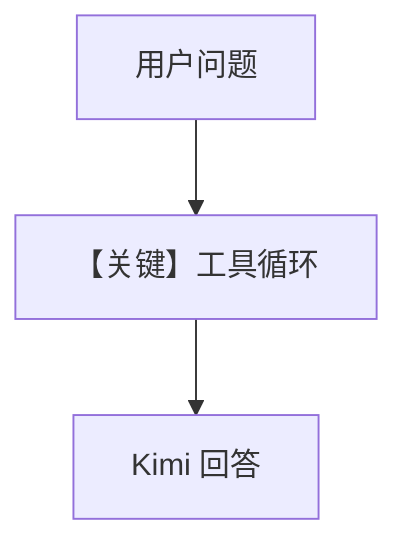

# tool_use.py — 实现原理分析

> 源文件：`cookbook/90_models/moonshot/tool_use.py`

## 概述

本示例展示 **`MoonShot` + WebSearchTools** 流式查询法国新闻。

**核心配置一览：**

| 配置项 | 值 | 说明 |
|--------|------|------|
| `model` | `MoonShot(id="kimi-k2-thinking")` | Chat Completions |
| `tools` | `[WebSearchTools()]` | 搜索 |
| `markdown` | `True` | 默认 |

## System Prompt 组装

含工具 instruction；无用户 description 字面量。

用户消息：`"What is happening in France?"`

## 完整 API 请求

`chat.completions.create` + `tools` + `tool_choice`。

## Mermaid 流程图

## 关键源码文件索引

| 文件 | 作用 |
|------|------|
| `agno/agent/_messages.py` | 工具并入 system |
