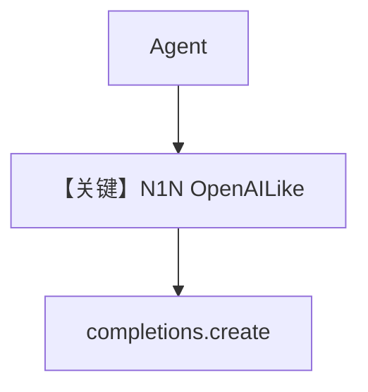

# basic.py — 实现原理分析

<!-- cookbook-py-source:start -->
## 完整源码

```python
"""
N1N Basic
=========

Cookbook example for `n1n/basic.py`.
"""

from agno.agent import Agent
from agno.models.n1n import N1N

# ---------------------------------------------------------------------------
# Create Agent
# ---------------------------------------------------------------------------

agent = Agent(model=N1N(id="gpt-4o"), markdown=True)

# ---------------------------------------------------------------------------
# Run Agent
# ---------------------------------------------------------------------------
if __name__ == "__main__":
    # --- Sync ---
    agent.print_response("Share a 2 sentence horror story.")

    # --- Sync + Streaming ---
    agent.print_response("Share a 2 sentence horror story.", stream=True)
```

<!-- cookbook-py-source:end -->

> 源文件：`cookbook/90_models/n1n/basic.py`

## 概述

本示例展示 **`N1N` 提供商 + `gpt-4o`** 的基础对话（OpenAI 兼容端点）。

**核心配置一览：**

| 配置项 | 值 | 说明 |
|--------|------|------|
| `model` | `N1N(id="gpt-4o")` | Chat Completions |
| `markdown` | `True` | 默认 |

## 完整 API 请求

与 OpenAI Chat 相同形态，base_url/api_key 由 `N1N` 模型类配置。

用户消息：`"Share a 2 sentence horror story."`

## Mermaid 流程图



## 关键源码文件索引

| 文件 | 作用 |
|------|------|
| `agno/models/n1n/` | `N1N` 定义 |
