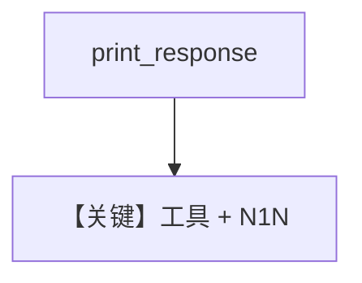

# tool_use.py — 实现原理分析

<!-- cookbook-py-source:start -->
## 完整源码

```python
"""
N1N Tool Use
============

Cookbook example for `n1n/tool_use.py`.
"""

from agno.agent import Agent
from agno.models.n1n import N1N
from agno.tools.websearch import WebSearchTools

# ---------------------------------------------------------------------------
# Create Agent
# ---------------------------------------------------------------------------

agent = Agent(
    model=N1N(id="gpt-5-mini"),
    markdown=True,
    tools=[WebSearchTools()],
)

agent.print_response("What is happening in France?", stream=True)

# ---------------------------------------------------------------------------
# Run Agent
# ---------------------------------------------------------------------------

if __name__ == "__main__":
    pass
```

<!-- cookbook-py-source:end -->

> 源文件：`cookbook/90_models/n1n/tool_use.py`

## 概述

本示例展示 **`N1N(id="gpt-5-mini")` + WebSearchTools** 流式查询。

**核心配置一览：**

| 配置项 | 值 | 说明 |
|--------|------|------|
| `model` | `N1N(id="gpt-5-mini")` | Chat |
| `tools` | `[WebSearchTools()]` | 搜索 |
| `markdown` | `True` | 默认 |

用户消息：`"What is happening in France?"`

## Mermaid 流程图



## 关键源码文件索引

| 文件 | 作用 |
|------|------|
| `agno/models/n1n/` | `N1N` |
