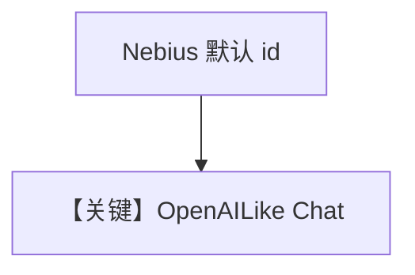

# basic.py — 实现原理分析

> 源文件：`cookbook/90_models/nebius/basic.py`

## 概述

本示例展示 **`Nebius()` 默认模型**（类默认 `id="openai/gpt-oss-20b"`，见 `agno/models/nebius/nebius.py` L22）与同步/异步、流式 `print_response`。

**核心配置一览：**

| 配置项 | 值 | 说明 |
|--------|------|------|
| `model` | `Nebius()` | Token Factory，OpenAI 兼容 |
| `markdown` | `True` | 默认 |

## 核心组件解析

需 `NEBIUS_API_KEY`；`base_url` 默认 `https://api.tokenfactory.nebius.com/v1/`。

用户消息：`"write a two sentence horror story"`

## System Prompt 组装

无用户 description；含 Markdown 默认句。

### 还原后的完整 System 文本

```text
Use markdown to format your answers.
```

## Mermaid 流程图



## 关键源码文件索引

| 文件 | 作用 |
|------|------|
| `agno/models/nebius/nebius.py` | `Nebius` L10+ |
