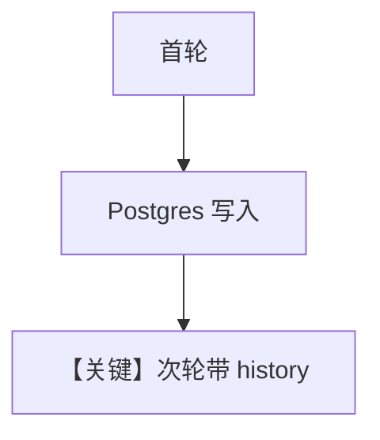

# db.py — 实现原理分析

> 源文件：`cookbook/90_models/nebius/db.py`

## 概述

本示例展示 **`PostgresDb` + `add_history_to_context=True` + WebSearchTools**：多轮对话依赖数据库存储的消息历史。

**核心配置一览：**

| 配置项 | 值 | 说明 |
|--------|------|------|
| `model` | `Nebius()` | 默认 `openai/gpt-oss-20b` |
| `db` | `PostgresDb(...)` | 会话与消息持久化 |
| `tools` | `[WebSearchTools()]` | 搜索 |
| `add_history_to_context` | `True` | 历史注入上下文 |

## 核心组件解析

第二轮起 `get_run_messages` 包含此前 user/assistant 消息。

用户消息：`"How many people live in Canada?"` 然后 `"What is their national anthem called?"`

## Mermaid 流程图

## 关键源码文件索引

| 文件 | 作用 |
|------|------|
| `agno/agent/_messages.py` | `get_run_messages` 历史 |
