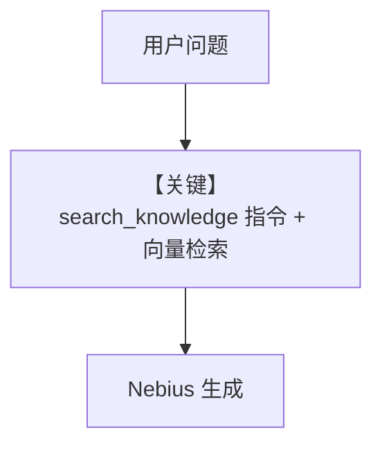

# knowledge.py — 实现原理分析

<!-- cookbook-py-source:start -->
## 完整源码

```python
"""Run `uv pip install ddgs sqlalchemy pgvector pypdf cerebras_cloud_sdk` to install dependencies."""

from agno.agent import Agent
from agno.knowledge.knowledge import Knowledge
from agno.models.nebius import Nebius
from agno.vectordb.pgvector import PgVector

# ---------------------------------------------------------------------------
# Create Agent
# ---------------------------------------------------------------------------

db_url = "postgresql+psycopg://ai:ai@localhost:5532/ai"

knowledge = Knowledge(
    vector_db=PgVector(table_name="recipes", db_url=db_url),
)
# Add content to the knowledge
knowledge.insert(url="https://agno-public.s3.amazonaws.com/recipes/ThaiRecipes.pdf")

agent = Agent(model=Nebius(id="Qwen/Qwen3-30B-A3B"), knowledge=knowledge)
agent.print_response("How to make Thai curry?", markdown=True)

# ---------------------------------------------------------------------------
# Run Agent
# ---------------------------------------------------------------------------

if __name__ == "__main__":
    pass
```

<!-- cookbook-py-source:end -->

> 源文件：`cookbook/90_models/nebius/knowledge.py`

## 概述

本示例展示 **`Knowledge` + `PgVector` + `Nebius(id="Qwen/Qwen3-30B-A3B")`**：PDF 入库后由 Agent 检索回答泰式咖喱做法。`Agent` 未显式写 `search_knowledge`，框架默认 `search_knowledge=True`（`agent.py` L197）。

**核心配置一览：**

| 配置项 | 值 | 说明 |
|--------|------|------|
| `model` | `Nebius(id="Qwen/Qwen3-30B-A3B")` | Chat |
| `knowledge` | `Knowledge(vector_db=PgVector(...))` | RAG |
| `search_knowledge` | 默认 `True` | 启用检索（未在源码显式写出） |

## 核心组件解析

`get_system_message()` 在 `# 3.3.13` 注入知识库检索说明（`build_context`）。

## System Prompt 组装

含知识库说明段（动态，来自 `knowledge.build_context`）。

用户消息：`"How to make Thai curry?"`，`markdown=True` 在 `print_response` 调用侧。

## Mermaid 流程图



## 关键源码文件索引

| 文件 | 作用 |
|------|------|
| `agno/agent/_messages.py` | `# 3.3.13` knowledge |
| `agno/knowledge/knowledge.py` | `Knowledge` |
