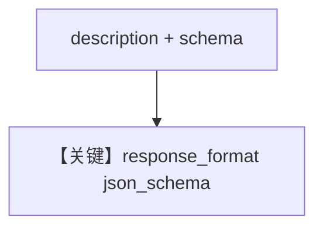

# structured_output.py — 实现原理分析

> 源文件：`cookbook/90_models/nebius/structured_output.py`

## 概述

本示例展示 **`Nebius` + `output_schema=MovieScript`** 与字面量 `description`。

**核心配置一览：**

| 配置项 | 值 | 说明 |
|--------|------|------|
| `model` | `Nebius(id="Qwen/Qwen3-30B-A3B")` | `supports_json_schema_outputs` 继承 OpenAIChat |
| `description` | 见下 | 静态 |
| `output_schema` | `MovieScript` | Pydantic |

## System Prompt 组装

### 还原后的完整 System 文本（description 原样）

```text
You are a helpful assistant. Summarize the movie script based on the location in a JSON object.
```

用户消息：`"New York"`

## Mermaid 流程图



## 关键源码文件索引

| 文件 | 作用 |
|------|------|
| `agno/models/openai/chat.py` | `get_request_params` |
