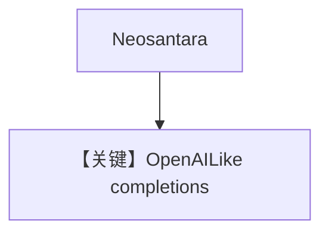

# basic.py — 实现原理分析

<!-- cookbook-py-source:start -->
## 完整源码

```python
"""
Neosantara Basic
================

Cookbook example for `neosantara/basic.py`.
"""

import asyncio

from agno.agent import Agent
from agno.models.neosantara import Neosantara

# ---------------------------------------------------------------------------
# Create Agent
# ---------------------------------------------------------------------------

agent = Agent(
    model=Neosantara(id="grok-4.1-fast-non-reasoning"),
    markdown=True,
)

# Print the response in the terminal

# ---------------------------------------------------------------------------
# Run Agent
# ---------------------------------------------------------------------------
if __name__ == "__main__":
    # --- Sync ---
    agent.print_response("Share a 2 sentence horror story")

    # --- Sync + Streaming ---
    agent.print_response("Share a 2 sentence horror story", stream=True)

    # --- Async ---
    asyncio.run(agent.aprint_response("Share a 2 sentence horror story"))

    # --- Async + Streaming ---
    asyncio.run(agent.aprint_response("Share a 2 sentence horror story", stream=True))
```

<!-- cookbook-py-source:end -->

> 源文件：`cookbook/90_models/neosantara/basic.py`

## 概述

本示例展示 **`Neosantara(id="grok-4.1-fast-non-reasoning")`** 基础对话，同步/异步与流式。

**核心配置一览：**

| 配置项 | 值 | 说明 |
|--------|------|------|
| `model` | `Neosantara(id="grok-4.1-fast-non-reasoning")` | OpenAI 兼容 |
| `markdown` | `True` | 默认 |

需 `NEOSANTARA_API_KEY`（见 `neosantara.py` L35+）。

用户消息：`"Share a 2 sentence horror story"`

## System Prompt 组装

```text
Use markdown to format your answers.
```

## Mermaid 流程图



## 关键源码文件索引

| 文件 | 作用 |
|------|------|
| `agno/models/neosantara/neosantara.py` | `Neosantara` |
