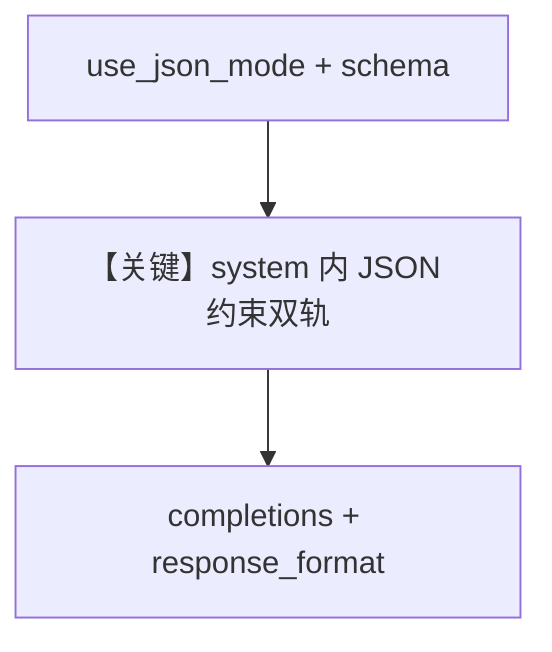

# structured_output.py — 实现原理分析

> 源文件：`cookbook/90_models/neosantara/structured_output.py`

## 概述

本示例展示 **`output_schema=MovieScript` + `use_json_mode=True`**：description 要求仅输出合法 JSON；与仅用 API `json_schema` 的示例不同，`use_json_mode=True` 会影响 `_messages.py` 中 `# 3.3.15` 是否追加 `get_json_output_prompt`（当 `(supports_native_structured_outputs or supports_json_schema_outputs) and (not use_json_mode or structured_outputs is True)` 为假时，更可能拼接长 JSON 说明）。

**核心配置一览：**

| 配置项 | 值 | 说明 |
|--------|------|------|
| `model` | `Neosantara(id="grok-4.1-fast-non-reasoning")` | OpenAILike |
| `description` | 见下 | 字面量 |
| `output_schema` | `MovieScript` | Pydantic |
| `use_json_mode` | `True` | JSON 模式相关分支 |

## System Prompt 组装

### 还原后的完整 System 文本（description 原样）

```text
You write movie scripts. Respond ONLY with a valid JSON object matching the provided schema.
```

（另含 `# 3.3.15` 可能追加的 `get_json_output_prompt` 长段，需运行时验证。）

用户消息：`"New York"`

## Mermaid 流程图



## 关键源码文件索引

| 文件 | 作用 |
|------|------|
| `agno/agent/_messages.py` | L425-435 `output_schema` 分支 |
| `agno/models/openai/chat.py` | `get_request_params` |
