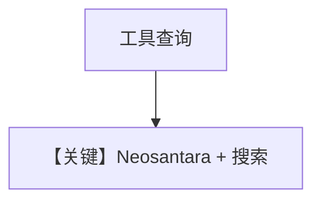

# tool_use.py — 实现原理分析

<!-- cookbook-py-source:start -->
## 完整源码

```python
"""
Neosantara Tool Use
===================

Cookbook example for `neosantara/tool_use.py`.
"""

import asyncio

from agno.agent import Agent
from agno.models.neosantara import Neosantara
from agno.tools.websearch import WebSearchTools

# ---------------------------------------------------------------------------
# Create Agent
# ---------------------------------------------------------------------------

agent = Agent(
    model=Neosantara(id="grok-4.1-fast-non-reasoning"),
    tools=[WebSearchTools()],
    markdown=True,
)

# Print the response in the terminal

# ---------------------------------------------------------------------------
# Run Agent
# ---------------------------------------------------------------------------
if __name__ == "__main__":
    # --- Sync ---
    agent.print_response(
        "What is the current stock price of NVDA and what is its 52 week high?"
    )

    # --- Async + Streaming ---
    asyncio.run(
        agent.aprint_response("What is the current stock price of NVDA?", stream=True)
    )
```

<!-- cookbook-py-source:end -->

> 源文件：`cookbook/90_models/neosantara/tool_use.py`

## 概述

本示例展示 **Neosantara + WebSearchTools**，查询 NVDA 股价与 52 周高点。

**核心配置一览：**

| 配置项 | 值 | 说明 |
|--------|------|------|
| `model` | `Neosantara(id="grok-4.1-fast-non-reasoning")` | Chat |
| `tools` | `[WebSearchTools()]` | 搜索 |
| `markdown` | `True` | 默认 |

用户消息：`"What is the current stock price of NVDA and what is its 52 week high?"` 等。

## Mermaid 流程图



## 关键源码文件索引

| 文件 | 作用 |
|------|------|
| `agno/models/neosantara/neosantara.py` | `Neosantara` |
