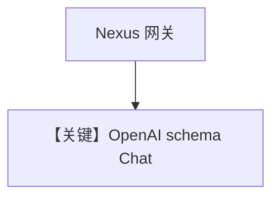

# basic.py — 实现原理分析

<!-- cookbook-py-source:start -->
## 完整源码

```python
"""
Nexus Basic
===========

Cookbook example for `nexus/basic.py`.
"""

from agno.agent import Agent, RunOutput  # noqa
from agno.models.nexus import Nexus
import asyncio

# ---------------------------------------------------------------------------
# Create Agent
# ---------------------------------------------------------------------------

agent = Agent(model=Nexus(id="anthropic/claude-sonnet-4-20250514"), markdown=True)

# Get the response in a variable
# run: RunOutput = agent.run("Share a 2 sentence horror story")
# print(run.content)

# Print the response in the terminal

# ---------------------------------------------------------------------------
# Run Agent
# ---------------------------------------------------------------------------
if __name__ == "__main__":
    # --- Sync ---
    agent.print_response("Share a 2 sentence horror story")

    # --- Sync + Streaming ---
    agent.print_response("Share a 2 sentence horror story", stream=True)

    # --- Async ---
    asyncio.run(agent.aprint_response("Share a 2 sentence horror story"))

    # --- Async + Streaming ---
    asyncio.run(agent.aprint_response("Share a 2 sentence horror story", stream=True))
```

<!-- cookbook-py-source:end -->

> 源文件：`cookbook/90_models/nexus/basic.py`

## 概述

本示例展示 **`Nexus(id="anthropic/claude-sonnet-4-20250514")`** 通过本地/远程 OpenAI 兼容网关（默认 `base_url` 见 `nexus.py` L22）访问模型。

**核心配置一览：**

| 配置项 | 值 | 说明 |
|--------|------|------|
| `model` | `Nexus(id="anthropic/claude-sonnet-4-20250514")` | OpenAILike |
| `markdown` | `True` | 默认 |

用户消息：`"Share a 2 sentence horror story"`

## Mermaid 流程图



## 关键源码文件索引

| 文件 | 作用 |
|------|------|
| `agno/models/nexus/nexus.py` | `Nexus` L7+ |
