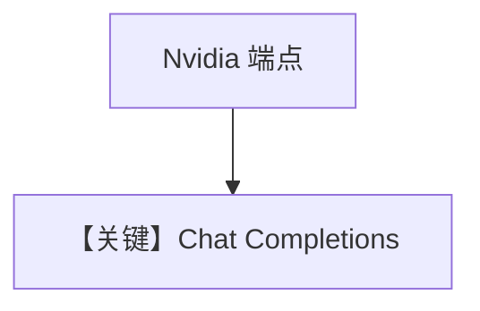

# basic.py — 实现原理分析

> 源文件：`cookbook/90_models/nvidia/basic.py`

## 概述

本示例展示 **`Nvidia(id="meta/llama-3.3-70b-instruct")`**（NVIDIA NIM/OpenAI 兼容）基础对话。

**核心配置一览：**

| 配置项 | 值 | 说明 |
|--------|------|------|
| `model` | `Nvidia(id="meta/llama-3.3-70b-instruct")` | OpenAILike |
| `markdown` | `True` | 默认 |

用户消息：`"Share a 2 sentence horror story"`

## Mermaid 流程图

## 关键源码文件索引

| 文件 | 作用 |
|------|------|
| `agno/models/nvidia/` | `Nvidia` |
