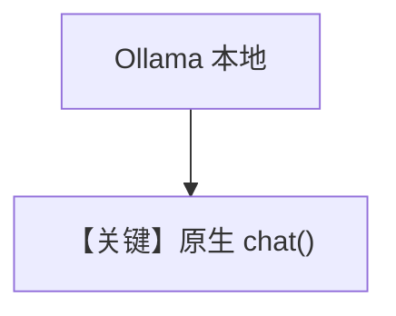

# basic.py — 实现原理分析

> 源文件：`cookbook/90_models/ollama/chat/basic.py`

## 概述

本示例展示 **本地 Ollama `Ollama(id="llama3.1:8b")`** 原生 Chat API（非 Responses），同步/异步与流式。

**核心配置一览：**

| 配置项 | 值 | 说明 |
|--------|------|------|
| `model` | `Ollama(id="llama3.1:8b")` | `agno/models/ollama/chat.py` 原生 `client.chat` |
| `markdown` | `True` | 默认 |

用户消息：horror story / breakfast recipe 等。

## 完整 API 请求

`Ollama.invoke` 使用 `get_client().chat(model=..., messages=...)`（见 `ollama/chat.py` 约 L230+）。

## Mermaid 流程图

## 关键源码文件索引

| 文件 | 作用 |
|------|------|
| `agno/models/ollama/chat.py` | `Ollama.invoke` |
