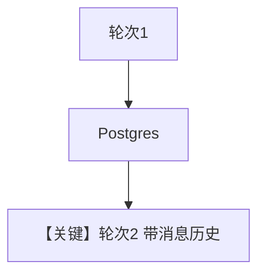

# db.py — 实现原理分析

> 源文件：`cookbook/90_models/ollama/chat/db.py`

## 概述

**`PostgresDb` + `add_history_to_context` + Ollama + WebSearchTools** 多轮带历史。

**核心配置一览：**

| 配置项 | 值 | 说明 |
|--------|------|------|
| `model` | `Ollama(id="llama3.1:8b")` | 原生 Ollama Chat |
| `db` | `PostgresDb` | 持久化 |
| `tools` | `[WebSearchTools()]` | 搜索 |
| `add_history_to_context` | `True` | 历史 |

用户消息：加拿大人口与国歌。

## Mermaid 流程图

## 关键源码文件索引

| 文件 | 作用 |
|------|------|
| `agno/agent/_messages.py` | `get_run_messages` |
