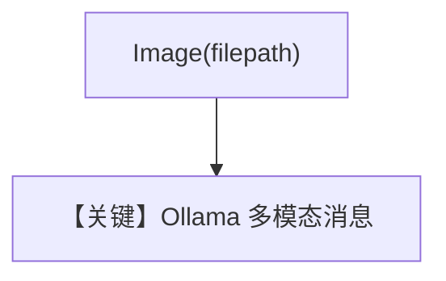

# demo_gemma.py — 实现原理分析

<!-- cookbook-py-source:start -->
## 完整源码

```python
"""
Ollama Demo Gemma
=================

Cookbook example for `ollama/chat/demo_gemma.py`.
"""

from pathlib import Path

from agno.agent import Agent
from agno.media import Image
from agno.models.ollama import Ollama

# ---------------------------------------------------------------------------
# Create Agent
# ---------------------------------------------------------------------------

agent = Agent(model=Ollama(id="gemma3:12b"), markdown=True)

image_path = Path(__file__).parent.joinpath("super-agents.png")
agent.print_response(
    "Write a 3 sentence fiction story about the image",
    images=[Image(filepath=image_path)],
    stream=True,
)

# ---------------------------------------------------------------------------
# Run Agent
# ---------------------------------------------------------------------------

if __name__ == "__main__":
    pass
```

<!-- cookbook-py-source:end -->

> 源文件：`cookbook/90_models/ollama/chat/demo_gemma.py`

## 概述

**`Ollama(id="gemma3:12b")` + 本地图像** 三句虚构故事，流式输出。

**核心配置一览：**

| 配置项 | 值 | 说明 |
|--------|------|------|
| `model` | `Ollama(id="gemma3:12b")` | 多模态取决于模型能力 |
| `markdown` | `True` | 默认 |

用户消息：`"Write a 3 sentence fiction story about the image"` + `Image(filepath=super-agents.png)`

## Mermaid 流程图



## 关键源码文件索引

| 文件 | 作用 |
|------|------|
| `agno/models/ollama/chat.py` | `_format_message` |
