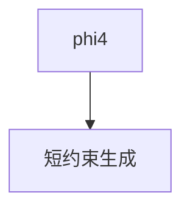

# demo_phi4.py — 实现原理分析

<!-- cookbook-py-source:start -->
## 完整源码

```python
"""
Ollama Demo Phi4
================

Cookbook example for `ollama/chat/demo_phi4.py`.
"""

from agno.agent import Agent, RunOutput  # noqa
from agno.models.ollama import Ollama

# ---------------------------------------------------------------------------
# Create Agent
# ---------------------------------------------------------------------------

agent = Agent(model=Ollama(id="phi4"), markdown=True)

# Print the response in the terminal
agent.print_response("Tell me a scary story in exactly 10 words.")

# ---------------------------------------------------------------------------
# Run Agent
# ---------------------------------------------------------------------------

if __name__ == "__main__":
    pass
```

<!-- cookbook-py-source:end -->

> 源文件：`cookbook/90_models/ollama/chat/demo_phi4.py`

## 概述

**`Ollama(id="phi4")`** 精确字数恐怖故事。

**核心配置一览：**

| 配置项 | 值 | 说明 |
|--------|------|------|
| `model` | `Ollama(id="phi4")` | 原生 chat |
| `markdown` | `True` | 默认 |

用户消息：`"Tell me a scary story in exactly 10 words."`

## Mermaid 流程图



## 关键源码文件索引

| 文件 | 作用 |
|------|------|
| `agno/models/ollama/chat.py` | `Ollama` |
