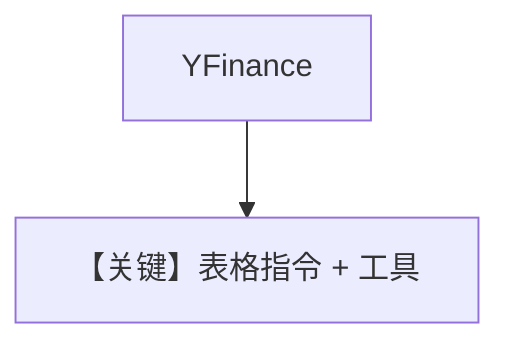

# demo_qwen.py — 实现原理分析

> 源文件：`cookbook/90_models/ollama/chat/demo_qwen.py`

## 概述

**`Ollama(id="qwen3:8b")` + YFinanceTools + instructions** 生成 NVDA 表格报告。

**核心配置一览：**

| 配置项 | 值 | 说明 |
|--------|------|------|
| `model` | `Ollama(id="qwen3:8b")` | 原生 chat |
| `tools` | `[YFinanceTools()]` | 金融数据 |
| `instructions` | `"Use tables to display data."` | 字面量 |

## System Prompt 组装

### 还原后的 instructions 原样

```text
Use tables to display data.
```

用户消息：`"Write a report on NVDA"`，`print_response(..., markdown=True)`。

## Mermaid 流程图



## 关键源码文件索引

| 文件 | 作用 |
|------|------|
| `agno/models/ollama/chat.py` | `Ollama.invoke` |
