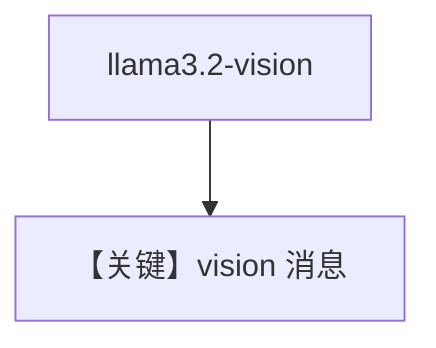

# image_agent.py — 实现原理分析

> 源文件：`cookbook/90_models/ollama/chat/image_agent.py`

## 概述

**`Ollama(id="llama3.2-vision")` + 本地图** 图像理解。

**核心配置一览：**

| 配置项 | 值 | 说明 |
|--------|------|------|
| `model` | `Ollama(id="llama3.2-vision")` | 视觉 |
| `markdown` | `True` | 默认 |

用户消息：`"Write a 3 sentence fiction story about the image"` + `super-agents.png`

## Mermaid 流程图

## 关键源码文件索引

| 文件 | 作用 |
|------|------|
| `agno/models/ollama/chat.py` | 多模态 formatting |
