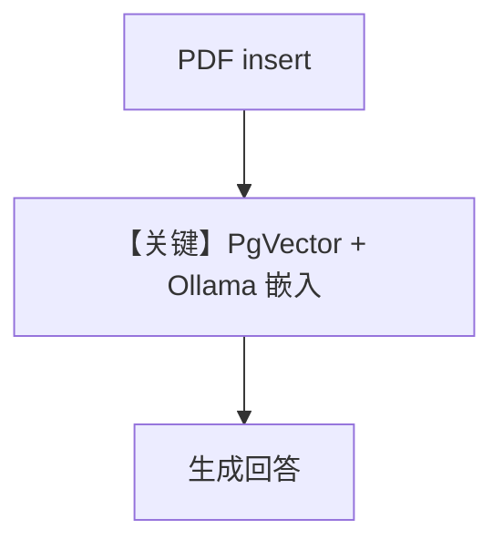

# knowledge.py — 实现原理分析

> 源文件：`cookbook/90_models/ollama/chat/knowledge.py`

## 概述

**`Knowledge` + `PgVector` + `OllamaEmbedder` + `Ollama(llama3.2)`** RAG；PDF 入库后问答泰式咖喱。

**核心配置一览：**

| 配置项 | 值 | 说明 |
|--------|------|------|
| `model` | `Ollama(id="llama3.2")` | 生成 |
| `knowledge` | `Knowledge(..., embedder=OllamaEmbedder(...))` | 向量检索 |
| `search_knowledge` | 默认 True | 未显式写出 |

## Mermaid 流程图

## 关键源码文件索引

| 文件 | 作用 |
|------|------|
| `agno/knowledge/knowledge.py` | `Knowledge` |
| `agno/agent/_messages.py` | `# 3.3.13` |
