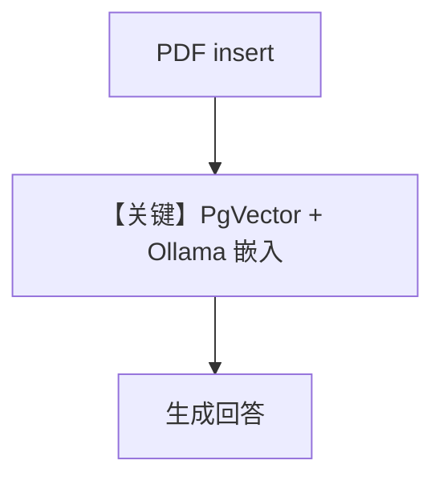

# knowledge.py — 实现原理分析

<!-- cookbook-py-source:start -->
## 完整源码

```python
"""Run `uv pip install ddgs sqlalchemy pgvector pypdf openai ollama` to install dependencies."""

from agno.agent import Agent
from agno.knowledge.embedder.ollama import OllamaEmbedder
from agno.knowledge.knowledge import Knowledge
from agno.models.ollama import Ollama
from agno.vectordb.pgvector import PgVector

# ---------------------------------------------------------------------------
# Create Agent
# ---------------------------------------------------------------------------

db_url = "postgresql+psycopg://ai:ai@localhost:5532/ai"

knowledge = Knowledge(
    vector_db=PgVector(
        table_name="recipes",
        db_url=db_url,
        embedder=OllamaEmbedder(id="llama3.2", dimensions=3072),
    ),
)
# Add content to the knowledge
knowledge.insert(url="https://agno-public.s3.amazonaws.com/recipes/ThaiRecipes.pdf")

agent = Agent(model=Ollama(id="llama3.2"), knowledge=knowledge)
agent.print_response("How to make Thai curry?", markdown=True)

# ---------------------------------------------------------------------------
# Run Agent
# ---------------------------------------------------------------------------

if __name__ == "__main__":
    pass
```

<!-- cookbook-py-source:end -->

> 源文件：`cookbook/90_models/ollama/chat/knowledge.py`

## 概述

**`Knowledge` + `PgVector` + `OllamaEmbedder` + `Ollama(llama3.2)`** RAG；PDF 入库后问答泰式咖喱。

**核心配置一览：**

| 配置项 | 值 | 说明 |
|--------|------|------|
| `model` | `Ollama(id="llama3.2")` | 生成 |
| `knowledge` | `Knowledge(..., embedder=OllamaEmbedder(...))` | 向量检索 |
| `search_knowledge` | 默认 True | 未显式写出 |

## Mermaid 流程图



## 关键源码文件索引

| 文件 | 作用 |
|------|------|
| `agno/knowledge/knowledge.py` | `Knowledge` |
| `agno/agent/_messages.py` | `# 3.3.13` |
