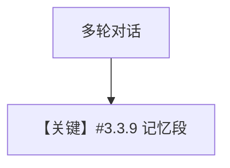

# memory.py — 实现原理分析

> 源文件：`cookbook/90_models/ollama/chat/memory.py`

## 概述

**`from agno.models.ollama.chat import Ollama`**（与 `from agno.models.ollama import Ollama` 同类）+ **`PostgresDb` + `update_memory_on_run` + `enable_session_summaries`**，多轮记忆与摘要。

**核心配置一览：**

| 配置项 | 值 | 说明 |
|--------|------|------|
| `model` | `Ollama(id="qwen2.5:latest")` | 原生 chat |
| `db` | `PostgresDb` | 持久化 |
| `update_memory_on_run` | `True` | 记忆 |
| `enable_session_summaries` | `True` | 摘要 |

## Mermaid 流程图

## 关键源码文件索引

| 文件 | 作用 |
|------|------|
| `agno/agent/_messages.py` | memories |
