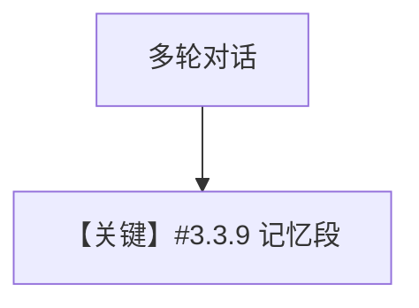

# memory.py — 实现原理分析

<!-- cookbook-py-source:start -->
## 完整源码

```python
"""
This recipe shows how to use personalized memories and summaries in an agent.
Steps:
1. Run: `./cookbook/scripts/run_pgvector.sh` to start a postgres container with pgvector
2. Run: `uv pip install ollama sqlalchemy 'psycopg[binary]' pgvector` to install the dependencies
3. Run: `python cookbook/92_models/ollama/memory.py` to run the agent
"""

from agno.agent import Agent
from agno.db.postgres import PostgresDb
from agno.models.ollama.chat import Ollama

# ---------------------------------------------------------------------------
# Create Agent
# ---------------------------------------------------------------------------

# Setup the database
db_url = "postgresql+psycopg://ai:ai@localhost:5532/ai"
db = PostgresDb(db_url=db_url)

agent = Agent(
    model=Ollama(id="qwen2.5:latest"),
    # Pass the database to the Agent
    db=db,
    # Enable user memories
    update_memory_on_run=True,
    # Enable session summaries
    enable_session_summaries=True,
    # Show debug logs so, you can see the memory being created
)

# -*- Share personal information
agent.print_response("My name is john billings?", stream=True)

# -*- Share personal information
agent.print_response("I live in nyc?", stream=True)

# -*- Share personal information
agent.print_response("I'm going to a concert tomorrow?", stream=True)

# Ask about the conversation
agent.print_response(
    "What have we been talking about, do you know my name?", stream=True
)

# ---------------------------------------------------------------------------
# Run Agent
# ---------------------------------------------------------------------------

if __name__ == "__main__":
    pass
```

<!-- cookbook-py-source:end -->

> 源文件：`cookbook/90_models/ollama/chat/memory.py`

## 概述

**`from agno.models.ollama.chat import Ollama`**（与 `from agno.models.ollama import Ollama` 同类）+ **`PostgresDb` + `update_memory_on_run` + `enable_session_summaries`**，多轮记忆与摘要。

**核心配置一览：**

| 配置项 | 值 | 说明 |
|--------|------|------|
| `model` | `Ollama(id="qwen2.5:latest")` | 原生 chat |
| `db` | `PostgresDb` | 持久化 |
| `update_memory_on_run` | `True` | 记忆 |
| `enable_session_summaries` | `True` | 摘要 |

## Mermaid 流程图



## 关键源码文件索引

| 文件 | 作用 |
|------|------|
| `agno/agent/_messages.py` | memories |
